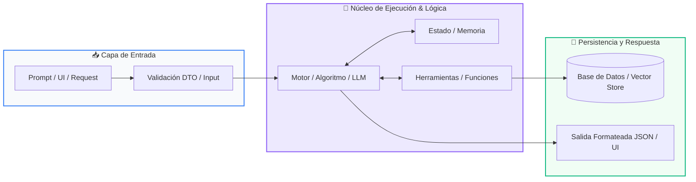

# Módulo 01: Fundamentos de IA Generativa y LLMs

<div class="grid cards" markdown>

-   :material-school: __Nivel:__ Avanzado
-   :material-book-open-page-variant: __Curso:__ Curso 3: Creación y Desarrollo de Agentes de IA
-   :material-lightbulb-on: __Metáfora:__ *«El Cerebro Probabilístico y el Molde de Salida»*
-   :material-file-pdf-box: __Descargar PDF:__ [01-fundamentos-ia-llm.pdf](https://github.com/wisrovi/wisrovi-python/blob/main/03-agentes-ia/01-fundamentos-ia-llm/01-fundamentos-ia-llm.pdf)

</div>

---

## 🎯 Objetivos de Aprendizaje

!!! abstract "Competencias Clave de la Sesión"
    *   **Competencia Conceptual:** Comprender la naturaleza probabilística de los LLMs, el cálculo de tokens, la ventana de contexto y el control determinista de temperatura.
    *   **Competencia Práctica:** Construir clientes robustos de IA en Python con validación estricta de esquemas de respuesta tipados.

---

## 1. 💡 Fundamentos Teóricos y Modelo Mental

Los LLMs no 'piensan' como los humanos; son gigantescas redes neuronales que predicen la siguiente palabra más probable dado un contexto.

!!! note "🌟 Metáfora Central: El Cerebro Probabilístico y el Molde de Salida"
    Un LLM es como un erudito que ha leído toda la biblioteca de Alejandría: si le haces una pregunta abierta responderá con fluidez literaria, pero si le colocas un molde rígido (un esquema JSON con Pydantic), vertirá su conocimiento exclusivamente dentro de la forma exacta que necesitas.

### Principios Fundamentales

Tokens y Contexto: Los textos se tokenizan en fragmentos sub-palabra; la ventana de contexto limita cuántos tokens puede procesar simultáneamente.

Parámetros Clave: Temperatura (0.0 para respuestas deterministas y código; 0.7+ para creatividad), Top-P y penalización de repetición.

!!! tip "⚡ Regla de Oro en Python"
    En entornos de producción nunca uses texto libre del LLM; fuerza siempre salidas tipadas estructuradas validadas con Pydantic.

---

## 2. 🗺️ Diagrama de Arquitectura y Flujo de Control

Flujo desde la construcción del System Prompt hasta la validación del objeto de salida.



### Desglose Paso a Paso del Flujo

| Fase del Flujo | Acción del Intérprete | Estado en Memoria |
| :--- | :--- | :--- |
| **1. Inicialización** | Construcción del System Prompt con instrucciones de rol y Few-Shot examples. | `Tokenización del prompt` |
| **2. Evaluación** | Envío a la API del modelo (Gemini / OpenAI / Ollama) con schema JSON. | `Inferencia en la GPU` |
| **3. Transformación** | El modelo genera un payload JSON estricto cumpliendo la especificación. | `Payload JSON crudo` |
| **4. Retorno / Salida** | Pydantic parsea y valida los tipos de datos en un objeto Python listo. | `Instancia BaseModel validada` |

!!! info "🔍 Visualización Mental"
    Trata al LLM como un microservicio no determinista: coloca siempre una capa de validación antes de entregar los datos a tu backend.

---

## 3. 💻 Implementación Práctica en Python

Esquema tipado para forzar respuestas deterministas en Python:

```python title="main.py - Python 3.10+ (PEP 8)" linenums="1"
from pydantic import BaseModel, Field
from typing import List

# Esquema de validación estricta
class AnalisisSentimiento(BaseModel):
    sentimiento: str = Field(description="POSITIVO, NEGATIVO o NEUTRO")
    puntuacion_confianza: float = Field(ge=0.0, le=1.0)
    temas_clave: List[str] = Field(default_factory=list)
    resumen_ejecutivo: str

# Simulación de respuesta parseada por el motor
payload_llm = '''{
    "sentimiento": "POSITIVO",
    "puntuacion_confianza": 0.96,
    "temas_clave": ["soporte rápido", "calidad software", "precio justo"],
    "resumen_ejecutivo": "El cliente expresa gran satisfacción con la atención recibida."
}'''

analisis = AnalisisSentimiento.model_validate_json(payload_llm)
print(f"Sentimiento: {analisis.sentimiento} ({analisis.puntuacion_confianza*100:.1f}%)")
print(f"Temas: {', '.join(analisis.temas_clave)}")
```

### Análisis Detallado del Código

Uso de Pydantic V2 para validación robusta con límites de rango numérico (ge, le) y serialización JSON directa.

---

## 4. 🛡️ Buenas Prácticas, Gotchas y Depuración

Errores frecuentes al conectar modelos de IA generativa a sistemas de software:

!!! warning "⚠️ Gotcha Frecuente (Trampa de Principiante)"
    Confiar ciegamente en que el LLM siempre responderá JSON válido sin capturar excepciones de parseo o alucinaciones.

### Comparativa: Patrón Recomendado vs Antipatrón

=== "✅ Patrón Pythonic Recomendado"
    ```python
try:
    data = Model.model_validate_json(llm_response)
except ValidationError as e:
    # Estrategia de reintento / corrección
    ```

=== "❌ Antipatrón / Mal Código"
    ```python
data = json.loads(llm_response) # Fallará si el LLM incluye texto extra
    ```

!!! success "🛡️ Consejo de Resiliencia en Producción"
    Utiliza Temperature=0.0 para extracción de datos, clasificación y generación de código reproducible.

---

## 5. 🏋️ Ejercicios y Desafío de Autoestudio

!!! example "Desafío Práctico Recomendado"
    Crea un script que consulte la API de Gemini u Ollama para resumir un artículo largo forzando salida en JSON con Pydantic.

???+ tip "🧪 Cómo validar tu solución con Pytest"
    Abre tu terminal en VS Code y ejecuta:
    ```bash
    pytest 03-agentes-ia/01-fundamentos-ia-llm/ejercicios/
    ```

---

## 6. 📚 Fuentes y Referencias Oficiales

| Fuente / Recurso | Descripción Temática | Enlace Oficial |
| :--- | :--- | :--- |
| **Documentación Oficial de Python** | Referencia canónica del lenguaje y librería estándar | [docs.python.org/3/](https://docs.python.org/3/) |
| **PEP 8 — Style Guide for Python** | Guía oficial de estilo, formato e indentación | [peps.python.org/pep-0008/](https://peps.python.org/pep-0008/) |
| **Real Python Tutorials** | Artículos técnicos y patrones de desarrollo moderno | [realpython.com](https://realpython.com/) |
| **Suite Open Source wisrovi** | Paquetes Python para orquestación y rendimiento | [github.com/wisrovi](https://github.com/wisrovi) |
