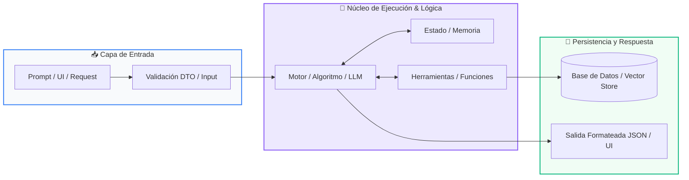

# Módulo 02: Herramientas, Memoria y RAG

<div class="grid cards" markdown>

-   :material-school: __Nivel:__ Avanzado
-   :material-book-open-page-variant: __Curso:__ Curso 3: Creación y Desarrollo de Agentes de IA
-   :material-lightbulb-on: __Metáfora:__ *«La Caja de Herramientas y el Bibliotecario con Memoria»*
-   :material-file-pdf-box: __Descargar PDF:__ [02-herramientas-y-memoria.pdf](https://github.com/wisrovi/wisrovi-python/blob/main/03-agentes-ia/02-herramientas-y-memoria/02-herramientas-y-memoria.pdf)

</div>

---

## 🎯 Objetivos de Aprendizaje

!!! abstract "Competencias Clave de la Sesión"
    *   **Competencia Conceptual:** Comprender cómo un modelo utiliza herramientas externas para ejecutar código y cómo RAG elimina alucinaciones inyectando contexto verificado.
    *   **Competencia Práctica:** Implementar un pipeline RAG con búsqueda por similitud de coseno y definir herramientas Python ejecutables por el modelo.

---

## 1. 💡 Fundamentos Teóricos y Modelo Mental

Un LLM aislado solo puede generar texto; cuando le otorgas herramientas y memoria, se transforma en un agente inteligente capaz de interactuar con el mundo.

!!! note "🌟 Metáfora Central: La Caja de Herramientas y el Bibliotecario con Memoria"
    El LLM es como un consultor brillante pero encerrado en una habitación: Tool Calling es darle un teléfono para llamar a APIs o consultar bases de datos. RAG es ponerle al lado a un bibliotecario que busca en segundos los documentos exactos de tu empresa y se los pasa antes de que responda.

### Principios Fundamentales

Tool Calling: El LLM decide qué función invocar y genera los argumentos exactos; tu código ejecuta la función y devuelve el resultado al LLM.

Embeddings Vectoriales: Representaciones numéricas de significado semántico; textos con significados similares tienen alta similitud de coseno en el espacio vectorial.

!!! tip "⚡ Regla de Oro en Python"
    RAG resuelve el problema del conocimiento desactualizado y las alucinaciones sin necesidad de reentrenar el modelo fundacional.

---

## 2. 🗺️ Diagrama de Arquitectura y Flujo de Control

Flujo de ingestión, búsqueda semántica y generación contextualizada con documentos privados.



### Desglose Paso a Paso del Flujo

| Fase del Flujo | Acción del Intérprete | Estado en Memoria |
| :--- | :--- | :--- |
| **1. Inicialización** | Los documentos se dividen en fragmentos (chunks) y se vectorizan con un modelo de embeddings. | `Vectores en Vector DB` |
| **2. Evaluación** | El usuario hace una pregunta; se vectoriza la consulta del usuario. | `Query vector` |
| **3. Transformación** | Se realiza búsqueda de similitud (k-Nearest Neighbors / Cosine Similarity) para extraer los chunks más relevantes. | `Contexto recuperado` |
| **4. Retorno / Salida** | Se ensambla el prompt enriquecido [Contexto + Pregunta] y el LLM formula la respuesta final respaldada en hechos. | `Respuesta precisa y sin alucinación` |

!!! info "🔍 Visualización Mental"
    RAG es el examen a libro abierto del LLM: en lugar de memorizar todo, le das el párrafo exacto donde está la respuesta.

---

## 3. 💻 Implementación Práctica en Python

Registro dinámico de funciones Python para ser ejecutadas autónomamente por el modelo:

```python title="main.py - Python 3.10+ (PEP 8)" linenums="1"
import json

# 1. Definición de la Herramienta en Python puro
def consultar_clima(ciudad: str) -> str:
    """Consulta la temperatura actual de una ciudad."""
    datos = {"Madrid": "24°C Despejado", "Bogotá": "18°C Lluvioso"}
    return datos.get(ciudad, "20°C Clima templado")

# 2. Registro de herramientas disponibles para el agente
HERRAMIENTAS_DISPONIBLES = {"consultar_clima": consultar_clima}

# 3. Simulación de orden de Tool Call emitida por el LLM
llamada_modelo = {
    "funcion": "consultar_clima",
    "argumentos": {"ciudad": "Madrid"}
}

# 4. Despachador de ejecución segura
nombre_fn = llamada_modelo["funcion"]
args = llamada_modelo["argumentos"]
resultado_tool = HERRAMIENTAS_DISPONIBLES[nombre_fn](**args)

print(f"Resultado de la herramienta para el LLM: {resultado_tool}")
```

### Análisis Detallado del Código

Mecanismo de despacho dinámico mediante desempaquetado de argumentos (**kwargs) para conectar funciones locales con el LLM.

---

## 4. 🛡️ Buenas Prácticas, Gotchas y Depuración

Errores clásicos al implementar memorias y herramientas:

!!! warning "⚠️ Gotcha Frecuente (Trampa de Principiante)"
    Fragmentar documentos en chunks demasiado grandes (que diluyen la relevancia semántica) o demasiado pequeños (que pierden contexto).

### Comparativa: Patrón Recomendado vs Antipatrón

=== "✅ Patrón Pythonic Recomendado"
    ```python
# Chunks de 300-500 tokens con 50 tokens de solapamiento (overlap)
    ```

=== "❌ Antipatrón / Mal Código"
    ```python
# Chunks de 5000 tokens: el embedding pierde especificidad semántica
    ```

!!! success "🛡️ Consejo de Resiliencia en Producción"
    Incluye siempre docstrings claros y detallados en tus funciones Python; los LLMs leen esos docstrings para saber cuándo invocar la herramienta.

---

## 5. 🏋️ Ejercicios y Desafío de Autoestudio

!!! example "Desafío Práctico Recomendado"
    Crea una herramienta que consulte una base de datos SQLite y permita a un LLM responder preguntas sobre inventarios.

???+ tip "🧪 Cómo validar tu solución con Pytest"
    Abre tu terminal en VS Code y ejecuta:
    ```bash
    pytest 03-agentes-ia/02-herramientas-y-memoria/ejercicios/
    ```

---

## 6. 📚 Fuentes y Referencias Oficiales

| Fuente / Recurso | Descripción Temática | Enlace Oficial |
| :--- | :--- | :--- |
| **Documentación Oficial de Python** | Referencia canónica del lenguaje y librería estándar | [docs.python.org/3/](https://docs.python.org/3/) |
| **PEP 8 — Style Guide for Python** | Guía oficial de estilo, formato e indentación | [peps.python.org/pep-0008/](https://peps.python.org/pep-0008/) |
| **Real Python Tutorials** | Artículos técnicos y patrones de desarrollo moderno | [realpython.com](https://realpython.com/) |
| **Suite Open Source wisrovi** | Paquetes Python para orquestación y rendimiento | [github.com/wisrovi](https://github.com/wisrovi) |
