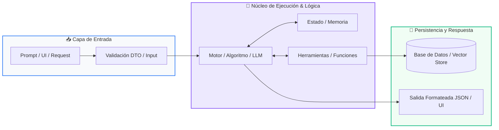

# Módulo 03: Construcción de Agentes Autónomos

<div class="grid cards" markdown>

-   :material-school: __Nivel:__ Avanzado
-   :material-book-open-page-variant: __Curso:__ Curso 3: Creación y Desarrollo de Agentes de IA
-   :material-lightbulb-on: __Metáfora:__ *«El Ciclo Cognitivo ReAct y el Enjambre de Agentes»*
-   :material-file-pdf-box: __Descargar PDF:__ [03-construccion-de-agentes.pdf](https://github.com/wisrovi/wisrovi-python/blob/main/03-agentes-ia/03-construccion-de-agentes/03-construccion-de-agentes.pdf)

</div>

---

## 🎯 Objetivos de Aprendizaje

!!! abstract "Competencias Clave de la Sesión"
    *   **Competencia Conceptual:** Comprender la diferencia entre un script lineal y un bucle de razonamiento autónomo donde el agente decide su próximo paso.
    *   **Competencia Práctica:** Construir un motor de agente ReAct en Python puro y orquestar flujos de trabajo multi-agente complejos.

---

## 1. 💡 Fundamentos Teóricos y Modelo Mental

Un agente autónomo no ejecuta un camino fijo; observa su entorno, razona sobre el objetivo, decide qué herramienta usar y evalúa los resultados de forma iterativa.

!!! note "🌟 Metáfora Central: El Ciclo Cognitivo ReAct y el Enjambre de Agentes"
    El ciclo ReAct es como un detective privado resolviendo un misterio: tiene un Pensamiento (Thought: 'Necesito ver la cámara de seguridad'), realiza una Acción (Action: busca el video con una herramienta), analiza la Observación (Observation: 'El sospechoso salió a las 10:00'), y repite el ciclo hasta llegar a la Respuesta Final.

### Principios Fundamentales

Ciclo Cognitivo: Thought (Razonamiento interno) -> Action (Invocación de herramienta) -> Observation (Lectura del entorno) -> Evaluación.

Sistemas Multi-Agente: División de trabajo entre agentes especializados (Investigador, Programador, Auditor de Calidad) orquestados por un Supervisor.

!!! tip "⚡ Regla de Oro en Python"
    Todo bucle de agente autónomo debe tener un límite estricto de pasos máximos (max_iterations) para evitar bucles infinitos y consumo desmedido de tokens.

---

## 2. 🗺️ Diagrama de Arquitectura y Flujo de Control

Flujo de control dinámico donde el agente decide autónomamente continuar investigando o emitir la solución final.



### Desglose Paso a Paso del Flujo

| Fase del Flujo | Acción del Intérprete | Estado en Memoria |
| :--- | :--- | :--- |
| **1. Inicialización** | Recibe la misión del usuario y formula el primer pensamiento estratégico. | `Thought 1 formulado` |
| **2. Evaluación** | Emite una orden de acción hacia una herramienta específica. | `Action: Tool invocation` |
| **3. Transformación** | Recibe la observación del entorno con los datos reales generados. | `Observation incorporada al prompt` |
| **4. Retorno / Salida** | ¿Objetivo cumplido? Si no, repite ciclo; si sí, genera Final Answer. | `Solución entregada` |

!!! info "🔍 Visualización Mental"
    El agente mantiene un historial acumulativo de pensamientos y observaciones pasadas para no repetir errores.

---

## 3. 💻 Implementación Práctica en Python

Implementación minimalista y autónoma del ciclo de razonamiento y acción:

```python title="main.py - Python 3.10+ (PEP 8)" linenums="1"
class AgenteReAct:
    def __init__(self, herramientas: dict, max_pasos: int = 5):
        self.herramientas = herramientas
        self.max_pasos = max_pasos
        self.memoria: list[str] = []

    def ejecutar_mision(self, objetivo: str) -> str:
        self.memoria.append(f"Objetivo: {objetivo}")
        for paso in range(1, self.max_pasos + 1):
            print(f"
--- [Paso {paso}] Ciclo Cognitivo ---")
            # 1. Simulación de pensamiento y decisión del LLM
            pensamiento = "Consultar base de datos para extraer métricas"
            accion_tool = "consultar_db"
            
            print(f"💭 Thought: {pensamiento}")
            print(f"⚡ Action: {accion_tool}()")
            
            # 2. Ejecución de la herramienta y observación
            observacion = "Ventas del mes: $45,000 USD (Crecimiento +12%)"
            print(f"👁️ Observation: {observacion}")
            
            # 3. Condición de término
            return f"Respuesta Final: Las ventas crecieron un 12% alcanzando $45,000 USD."
        return "Límite de pasos alcanzado."
```

### Análisis Detallado del Código

Clase controladora que orquesta el bucle de ejecución de agentes, acumula contexto en memoria episódica y previene bloqueos.

---

## 4. 🛡️ Buenas Prácticas, Gotchas y Depuración

Riesgos arquitectónicos en sistemas multi-agente autónomos:

!!! warning "⚠️ Gotcha Frecuente (Trampa de Principiante)"
    Permitir que un agente ejecute comandos en el sistema operativo o mutaciones destructivas en bases de datos sin una capa de confirmación humana (Human-in-the-loop).

### Comparativa: Patrón Recomendado vs Antipatrón

=== "✅ Patrón Pythonic Recomendado"
    ```python
# Validar permisos y requerir confirmación antes de acciones críticas
    ```

=== "❌ Antipatrón / Mal Código"
    ```python
# Agente ejecutando rm -rf o DROP TABLE sin validación
    ```

!!! success "🛡️ Consejo de Resiliencia en Producción"
    Implementa timeouts y presupuestos de tokens por sesión para evitar costos imprevistos en APIs comerciales.

---

## 5. 🏋️ Ejercicios y Desafío de Autoestudio

!!! example "Desafío Práctico Recomendado"
    Construye un sistema de dos agentes donde el primer agente genere un reporte y el segundo actúe como auditor crítico.

???+ tip "🧪 Cómo validar tu solución con Pytest"
    Abre tu terminal en VS Code y ejecuta:
    ```bash
    pytest 03-agentes-ia/03-construccion-de-agentes/ejercicios/
    ```

---

## 6. 📚 Fuentes y Referencias Oficiales

| Fuente / Recurso | Descripción Temática | Enlace Oficial |
| :--- | :--- | :--- |
| **Documentación Oficial de Python** | Referencia canónica del lenguaje y librería estándar | [docs.python.org/3/](https://docs.python.org/3/) |
| **PEP 8 — Style Guide for Python** | Guía oficial de estilo, formato e indentación | [peps.python.org/pep-0008/](https://peps.python.org/pep-0008/) |
| **Real Python Tutorials** | Artículos técnicos y patrones de desarrollo moderno | [realpython.com](https://realpython.com/) |
| **Suite Open Source wisrovi** | Paquetes Python para orquestación y rendimiento | [github.com/wisrovi](https://github.com/wisrovi) |
