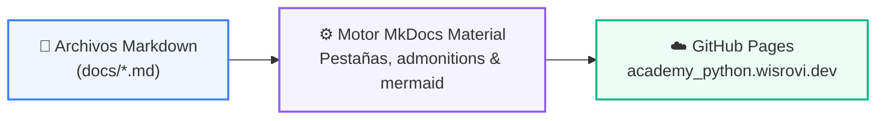

# 🌐 Documentación Web Interactiva: curso-04

> **Sitio Web Oficial:** [`academy_python.wisrovi.dev`](https://academy_python.wisrovi.dev/)  
> **Ubicación:** `docs/curso-04`  

---

## 🌀 Arquitectura del Sitio Web de Documentación



---

## 💻 Servidor Local de Previsualización
```bash
mkdocs serve
```
