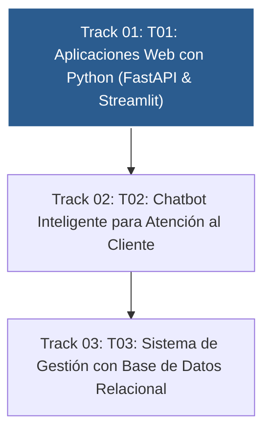

# 📚 Curso 4: Taller Práctico & Proyecto Final Personalizado

> **Construcción de Soluciones Reales: Full-Stack Web, Chatbot Inteligente y BD SQL**  
> **Nivel:** Integrador &bull; **Instructor:** **William Rodríguez (Wisrovi)** (AI Solutions Architect & Principal Software Engineer)

---

## 🗺️ Mapa de Contenidos del Curso

---

## 📑 Unidades Didácticas del Curso

| Unidad | Título | Metáfora Central | Enfoque Principal |
| :---: | :--- | :--- | :--- |
| **Track 01** | **Track 01: Aplicaciones Web con Python (FastAPI & Streamlit)** | *«El Restaurante: La Carta (Frontend) y la Cocina de Alta Eficiencia (Backend)»* | Comprender la separación de responsabilidades Cliente-Servidor, APIs RESTful y e... |
| **Track 02** | **Track 02: Chatbot Inteligente para Atención al Cliente** | *«El Recepcionista Omnicanal y el Manual de Operaciones»* | Comprender la gestión del estado conversacional, el enrutamiento de intenciones ... |
| **Track 03** | **Track 03: Sistema de Gestión con Base de Datos Relacional** | *«El Archivo Notarial y la Bóveda de Datos ACID»* | Comprender el modelo relacional de datos, las claves primarias/foráneas y la int... |

---

## 🚲 Metodología: La Regla de la Bicicleta

> *"Nadie aprende a montar en bicicleta viendo tutoriales. El verdadero dominio de la programación surge cuando abres tu editor, escribes código con tus propias manos, resuelves errores y construyes proyectos reales."*

!!! tip "Cómo estudiar este curso"
    1. Lee la lección temática de cada unidad.
    2. Analiza el diagrama de flujo y comprende el movimiento de los datos en memoria.
    3. Escribe y ejecuta el código en VS Code o en Google Colab.
    4. Resuelve los ejercicios y valida tu código ejecutando `pytest`.
