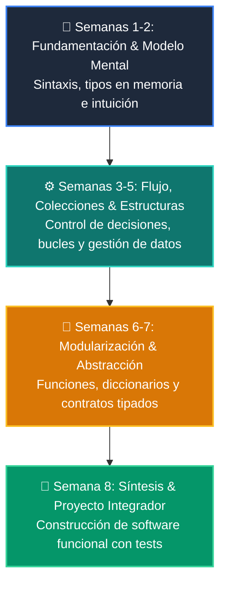

# 📚 Manual Oficial: Curso 4: Taller Práctico & Proyecto Final Integrador

-   :material-school: **Nivel:** `Nivel 4 (Integrador / Profesional)`
-   :material-calendar-clock: **Duración:** 8 Semanas Formativas
-   :material-account-tie: **Instructor:** [William Rodríguez (Wisrovi)](https://wisrovi.dev)
-   :material-file-pdf-box: **PDF Completo:** [Descargar curso-04-proyecto-final.pdf](https://github.com/wisrovi/wisrovi-python/raw/main/04-proyecto-final/curso-04-proyecto-final.pdf)

---

## 🗺️ Mapa de Clases Semanales

| Semana | Unidad Temática | Metáfora Didáctica |
| :---: | :--- | :--- |
| **CLASE 01** | [Arquitectura de Software y Planificación del Proyecto](clase-01.md) | *«Diseñar los Planos de un Edificio Antes de Poner el Primer Ladrillo»* |
| **CLASE 02** | [APIs RESTful con FastAPI](clase-02.md) | *«FastAPI como un Centro Logístico de Alta Velocidad para Peticiones HTTP»* |
| **CLASE 03** | [Modelado SQL y Transacciones ACID](clase-03.md) | *«La Base de Datos como una Bóveda Acorazada para la Información»* |
| **CLASE 04** | [Dashboards con Streamlit](clase-04.md) | *«Streamlit como el Salón de Control Visual para tu Backend de Python»* |
| **CLASE 05** | [Integración del Motor de IA y Agentes en la App](clase-05.md) | *«Conectar el Cerebro del Agente al Sistema Nervioso de la Aplicación»* |
| **CLASE 06** | [Testing Riguroso con Pytest, Mocks y Calidad](clase-06.md) | *«Los Tests como el Control de Calidad y Pruebas de Choque de un Vehículo»* |
| **CLASE 07** | [Containerización Profesional con Docker y Compose](clase-07.md) | *«Docker como Contenedores Estándar de Carga Marítima para Software»* |
| **CLASE 08** | [Despliegue en la Nube, CI/CD y Portafolio Final](clase-08.md) | *«Lanzamiento a Producción y Presentación de tu Proyecto ante el Mundo»* |

---

## 🌀 Progresión Formativa del Curso

---

## 📑 Clases del Curso
Haz clic en cualquiera de las clases del menú lateral o de la tabla superior para estudiar la teoría, ejecutar los ejemplos y resolver los retos prácticos.
