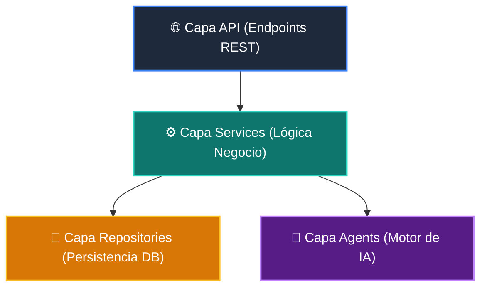

# 📘 Clase 01: Arquitectura de Software y Planificación del Proyecto

<div class="grid cards" markdown>

-   :material-bookmark: **Curso:** Curso 4: Taller Práctico & Proyecto Final Integrador (CLASE 01)
-   :material-signal-cellular-outline: **Nivel:** `Nivel 4 - Integrador`
-   :material-lightbulb-on: **Metáfora Central:** *«El Plano del Rascacielos Modular (Clean Architecture)»*
-   :material-laptop: **Wisrovi Studio (Local):** [🚀 Abrir Reto](http://127.0.0.1:8501/?course=4&class=1) &bull; [👨‍🏫 Modo Tutor](http://127.0.0.1:8501/tutor?course=4&class=1)
-   :material-file-pdf-box: **Manual PDF Oficial:** [Descargar clase-01-arquitectura-y-planificacion.pdf](https://github.com/wisrovi/wisrovi-python/raw/main/04-proyecto-final/clase-01-arquitectura-y-planificacion/clase-01-arquitectura-y-planificacion.pdf)

</div>

<div align="center" style="margin: 1rem 0;" markdown>

[](https://colab.research.google.com/github/wisrovi/wisrovi-python/blob/main/04-proyecto-final/clase-01-arquitectura-y-planificacion/notebook/clase-01-arquitectura-y-planificacion.ipynb)
[-0284c7?logo=python&logoColor=white)](http://127.0.0.1:8501/?course=4&class=1)
[](https://github.com/wisrovi/wisrovi-python/tree/main/04-proyecto-final/clase-01-arquitectura-y-planificacion)

</div>

---

## 1. 💡 Fundamentación Teórica y Modelo Mental

Diseño modular y desacoplado para aplicaciones de producción:
1. **Separación de Responsabilidades**: `api` (controladores), `core` (configuración), `models` (entidades), `services` (lógica de negocio).
2. **Inversión de Dependencias**: Los módulos de alto nivel no dependen de los de bajo nivel; ambos dependen de abstracciones.
3. **Verificación de Estructura**: Validar que el proyecto posea todas las capas obligatorias.

!!! note "🌟 Modelo Mental de la Sesión: «El Plano del Rascacielos Modular (Clean Architecture)»"
    En esta sesión anclamos el aprendizaje en la metáfora del mundo real para visualizar cómo fluyen las estructuras de datos y el flujo de ejecución en la memoria.

---

## 2. 🗺️ Arquitectura de Ejecución y Diagrama de Flujo



---

## 3. 💻 Código de Implementación Práctica

=== "🚀 Demostración en Vivo"
    ```python
    MODULOS_OBLIGATORIOS = {"api", "core", "models", "services", "tests"}

def validar_modulos(modulos_presentes: list[str]) -> bool:
    return MODULOS_OBLIGATORIOS.issubset(set(modulos_presentes))

print("¿Arquitectura válida?:", validar_modulos(["api", "core", "models", "services", "tests", "ui"]))
    ```

=== "🔬 Arenero de Exploración de Memoria (RAM)"
    ```python
    carpetas = ["src/api", "src/services", "src/models", "tests"]
print("Estructura definida:", carpetas)
    ```

---

## 4. 🛡️ Buenas Prácticas PEP 8: Antipatrones vs Código Pythonic

!!! warning "⚠️ Cuidado con los Antipatrones"
    

=== "❌ Antipatrón / Código Inadecuado"
    ```python
    # En archivo del frontend:
# cursor.execute('INSERT INTO...') ❌ Acoplamiento peligroso
    ```

=== "✅ Patrón Recomendado / Pythonic"
    ```python
    # Frontend -> Llama a API REST -> API invoca Repositorio -> BD ✅
    ```

---

## 5. 🏋️ Desafío Práctico de la Clase

!!! example "🎯 Enunciado del Reto"
    **Crea una función `validar_estructura_proyecto(modulos: list[str]) -> bool` que retorne `True` si la lista contiene al menos los 5 módulos base: 'api', 'core', 'models', 'services', 'tests'.**

!!! tip "⚡ Resolución Híbrida en 1 Clic (Local + Web)"
    Si tienes ejecutando `wisrovi ui` en tu terminal local, puedes [🚀 Abrir este Reto directamente en tu Studio Local (127.0.0.1:8501)](http://127.0.0.1:8501/?course=4&class=1) para escribir tu código con auto-formateo AST, inspeccionar variables en el Heap/Stack y evaluarlo con pruebas en tiempo real.

=== "💻 Plantilla de Inicio (Starter Code)"
    ```python
    def validar_estructura_proyecto(modulos: list[str]) -> bool:
    # ✍️ Verifica que contenga api, core, models, services, tests
    requeridos = {"api", "core", "models", "services", "tests"}
    return requeridos.issubset(set(modulos))

    ```

??? info "💡 Pista Socrática 1"
    💡 Pista 1: Define el conjunto requerido: `{'api', 'core', 'models', 'services', 'tests'}`.

??? info "💡 Pista Socrática 2"
    💡 Pista 2: Usa `.issubset(set(modulos))` para verificar la inclusión.

??? info "💡 Pista Socrática 3"
    💡 Pista 3: Retorna el resultado booleano.


Para resolver este ejercicio en tu entorno:
1. Abre el archivo `ejercicios/reto.py` de esta clase en Visual Studio Code o utiliza `wisrovi ui` / `wisrovi tutor`.
2. Implementa tu solución cumpliendo los requisitos y contratos de tipado.
3. Valida tus resultados ejecutando las pruebas unitarias:
   ```bash
   pytest tests/curso_04/test_clase_01_arquitectura_y_planificacion.py
   ```

---


## 6. 📚 Fuentes y Bibliografía Recomendada

*   [📖 Documentación Oficial de Python 3](https://docs.python.org/3/)
*   [📑 Guía de Estilo Oficial PEP 8](https://peps.python.org/pep-0008/)
*   [📦 Ecosistema Open Source wisrovi en PyPI](https://pypi.org/user/wisrovi/)
