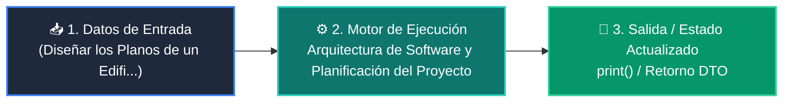

# 📘 Clase 01: Arquitectura de Software y Planificación del Proyecto

<div class="grid cards" markdown>

-   :material-bookmark: **Curso:** Curso 4: Taller Práctico & Proyecto Final Integrador (CLASE 01)
-   :material-signal-cellular-outline: **Nivel:** `Nivel 4 - Integrador`
-   :material-lightbulb-on: **Metáfora Central:** *«Diseñar los Planos de un Edificio Antes de Poner el Primer Ladrillo»*
-   :material-file-pdf-box: **Manual PDF Oficial:** [Descargar clase-01-arquitectura-y-planificacion.pdf](https://github.com/wisrovi/wisrovi-python/raw/main/04-proyecto-final/clase-01-arquitectura-y-planificacion/clase-01-arquitectura-y-planificacion.pdf)

</div>

<div align="center" style="margin: 1rem 0;" markdown>

[](https://colab.research.google.com/github/wisrovi/wisrovi-python/blob/main/04-proyecto-final/clase-01-arquitectura-y-planificacion/notebook/clase-01-arquitectura-y-planificacion.ipynb)
[](https://github.com/wisrovi/wisrovi-python/tree/main/04-proyecto-final/clase-01-arquitectura-y-planificacion)

</div>

---

## 1. 💡 Fundamentación Teórica y Modelo Mental


!!! note "🌟 Modelo Mental de la Sesión: «Diseñar los Planos de un Edificio Antes de Poner el Primer Ladrillo»"
    Diseñar el software es como dibujar los planos estructurales de una casa: define dónde irán las tuberías (APIs) y los cimientos (BD).

### Principios Fundamentales de la Sesión


!!! info "⚡ Regla de Oro en Python"
    Nunca empieces a codificar sin tener un diagrama de arquitectura y las entidades de datos definidas.

---

## 2. 🗺️ Arquitectura de Ejecución y Diagrama de Flujo



---

## 3. 💻 Código de Implementación Práctica

```python
from pydantic import BaseModel
from typing import Optional
from datetime import datetime

class ProyectoConfig(BaseModel):
    nombre_app: str = "Wisrovi Enterprise App"
    version: str = "1.0.0"
    debug: bool = False

class ItemDTO(BaseModel):
    id: Optional[int] = None
    titulo: str
    creado_en: datetime = datetime.now()

config = ProyectoConfig()
print(f"Iniciando arquitectura para: {config.nombre_app} v{config.version}")
```

---

## 4. 🛡️ Buenas Prácticas, Gotchas y Prevención de Errores

!!! warning "⚠️ Trampa Frecuente (Gotcha)"
    Colocar consultas SQL directamente dentro de los componentes visuales del frontend destruye la mantenibilidad.

=== "❌ Antipatrón / Código Inadecuado"
    ```python
    # En archivo del frontend:
# cursor.execute('INSERT INTO...') ❌ Acoplamiento peligroso
    ```

=== "✅ Patrón Recomendado / Pythonic"
    ```python
    # Frontend -> Llama a API REST -> API invoca Repositorio -> BD ✅
    ```

!!! tip "🔧 Consejo de Ingeniería"
    

---

## 5. 🏋️ Desafío Práctico de la Clase

!!! example "🎯 Enunciado del Reto"
    **Dibuja el diagrama de arquitectura y redacta las 5 rutas principales de tu API.**

Para resolver este ejercicio en tu entorno:
1. Abre el archivo `ejercicios/reto.py` de esta clase en Visual Studio Code.
2. Implementa tu solución cumpliendo los requisitos y contratos de tipo.
3. Valida tus resultados ejecutando las pruebas unitarias:
   ```bash
   pytest tests/curso_04/test_clase_01_arquitectura_y_planificacion.py
   ```

---

## 6. 📚 Fuentes y Bibliografía Recomendada

*   [📖 Documentación Oficial de Python 3](https://docs.python.org/3/)
*   [📑 Guía de Estilo Oficial PEP 8](https://peps.python.org/pep-0008/)
*   [📦 Ecosistema Open Source wisrovi en PyPI](https://pypi.org/user/wisrovi/)
