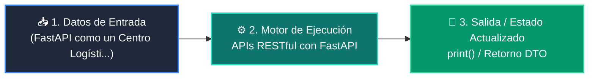

# 📘 Clase 02: Desarrollo del Backend: APIs RESTful con FastAPI

<div class="grid cards" markdown>

-   :material-bookmark: **Curso:** Curso 4: Taller Práctico & Proyecto Final Integrador (CLASE 02)
-   :material-signal-cellular-outline: **Nivel:** `Nivel 4 - Integrador`
-   :material-lightbulb-on: **Metáfora Central:** *«FastAPI como un Centro Logístico de Alta Velocidad para Peticiones HTTP»*
-   :material-file-pdf-box: **Manual PDF Oficial:** [Descargar clase-02-backend-fastapi.pdf](https://github.com/wisrovi/wisrovi-python/raw/main/04-proyecto-final/clase-02-backend-fastapi/clase-02-backend-fastapi.pdf)

</div>

<div align="center" style="margin: 1rem 0;" markdown>

[](https://colab.research.google.com/github/wisrovi/wisrovi-python/blob/main/04-proyecto-final/clase-02-backend-fastapi/notebook/clase-02-backend-fastapi.ipynb)
[](https://github.com/wisrovi/wisrovi-python/tree/main/04-proyecto-final/clase-02-backend-fastapi)

</div>

---

## 1. 💡 Fundamentación Teórica y Modelo Mental


!!! note "🌟 Modelo Mental de la Sesión: «FastAPI como un Centro Logístico de Alta Velocidad para Peticiones HTTP»"
    FastAPI es una ventanilla de atención ultra rápida: valida tu formulario antes de atenderte y te entrega un recibo oficial.

### Principios Fundamentales de la Sesión


!!! info "⚡ Regla de Oro en Python"
    Retorna siempre códigos de estado HTTP semánticos (ej. 201 Created tras un POST exitoso).

---

## 2. 🗺️ Arquitectura de Ejecución y Diagrama de Flujo



---

## 3. 💻 Código de Implementación Práctica

```python
from fastapi import FastAPI, HTTPException
from pydantic import BaseModel

app = FastAPI(title="Servicio de Productos API", version="1.0.0")

class Producto(BaseModel):
    id: int
    nombre: str
    precio: float

DB_ITEMS = {}

@app.post("/productos", status_code=201)
def crear_producto(prod: Producto):
    if prod.id in DB_ITEMS:
        raise HTTPException(status_code=400, detail="El producto ya existe.")
    DB_ITEMS[prod.id] = prod
    return {"mensaje": "Creado con éxito", "producto": prod}

@app.get("/productos/{item_id}")
def obtener_producto(item_id: int):
    if item_id not in DB_ITEMS:
        raise HTTPException(status_code=404, detail="No encontrado")
    return DB_ITEMS[item_id]
```

---

## 4. 🛡️ Buenas Prácticas, Gotchas y Prevención de Errores

!!! warning "⚠️ Trampa Frecuente (Gotcha)"
    Usar funciones síncronas bloqueantes (como time.sleep) dentro de funciones async def congela todo el servidor.

=== "❌ Antipatrón / Código Inadecuado"
    ```python
    async def endpoint():
    time.sleep(5)  # ❌ Bloquea el event loop para todos los usuarios
    ```

=== "✅ Patrón Recomendado / Pythonic"
    ```python
    async def endpoint():
    await asyncio.sleep(5)  # ✅ No bloqueante
    ```

!!! tip "🔧 Consejo de Ingeniería"
    

---

## 5. 🏋️ Desafío Práctico de la Clase

!!! example "🎯 Enunciado del Reto"
    **Añade endpoints PUT (actualizar) y DELETE a la API de productos con validación de existencia.**

Para resolver este ejercicio en tu entorno:
1. Abre el archivo `ejercicios/reto.py` de esta clase en Visual Studio Code.
2. Implementa tu solución cumpliendo los requisitos y contratos de tipo.
3. Valida tus resultados ejecutando las pruebas unitarias:
   ```bash
   pytest tests/curso_04/test_clase_02_backend_fastapi.py
   ```

---

## 6. 📚 Fuentes y Bibliografía Recomendada

*   [📖 Documentación Oficial de Python 3](https://docs.python.org/3/)
*   [📑 Guía de Estilo Oficial PEP 8](https://peps.python.org/pep-0008/)
*   [📦 Ecosistema Open Source wisrovi en PyPI](https://pypi.org/user/wisrovi/)
