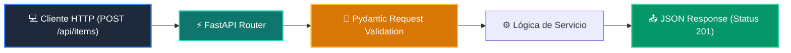

# 📘 Clase 02: Desarrollo del Backend: APIs RESTful con FastAPI

<div class="grid cards" markdown>

-   :material-bookmark: **Curso:** Curso 4: Taller Práctico & Proyecto Final Integrador (CLASE 02)
-   :material-signal-cellular-outline: **Nivel:** `Nivel 4 - Integrador`
-   :material-lightbulb-on: **Metáfora Central:** *«El Mesero de Restaurante de Alta Cocina (Petición -> Cocina -> Plato)»*
-   :material-laptop: **Wisrovi Studio (Local):** [🚀 Abrir Reto](http://127.0.0.1:8501/?course=4&class=2) &bull; [👨‍🏫 Modo Tutor](http://127.0.0.1:8501/tutor?course=4&class=2)
-   :material-file-pdf-box: **Manual PDF Oficial:** [Descargar clase-02-backend-fastapi.pdf](https://github.com/wisrovi/wisrovi-python/raw/main/04-proyecto-final/clase-02-backend-fastapi/clase-02-backend-fastapi.pdf)

</div>

<div align="center" style="margin: 1rem 0;" markdown>

[](https://colab.research.google.com/github/wisrovi/wisrovi-python/blob/main/04-proyecto-final/clase-02-backend-fastapi/notebook/clase-02-backend-fastapi.ipynb)
[-0284c7?logo=python&logoColor=white)](http://127.0.0.1:8501/?course=4&class=2)
[](https://github.com/wisrovi/wisrovi-python/tree/main/04-proyecto-final/clase-02-backend-fastapi)

</div>

---

## 1. 💡 Fundamentación Teórica y Modelo Mental

Construcción de APIs asíncronas de alto rendimiento con FastAPI y validación OpenAPI:
1. **Rutas y Verbos HTTP**: `GET` (consultar), `POST` (crear), `PUT` (actualizar), `DELETE` (eliminar).
2. **Inyección de Dependencias (`Depends`)**: Gestión limpia de sesiones de base de datos y autenticación.
3. **Pydantic Response Models**: Sanitización automática de datos expuestos al cliente.

!!! note "🌟 Modelo Mental de la Sesión: «El Mesero de Restaurante de Alta Cocina (Petición -> Cocina -> Plato)»"
    En esta sesión anclamos el aprendizaje en la metáfora del mundo real para visualizar cómo fluyen las estructuras de datos y el flujo de ejecución en la memoria.

---

## 2. 🗺️ Arquitectura de Ejecución y Diagrama de Flujo



---

## 3. 💻 Código de Implementación Práctica

=== "🚀 Demostración en Vivo"
    ```python
    from pydantic import BaseModel

class ProductoInput(BaseModel):
    id: int
    nombre: str
    precio: float

def mock_endpoint_crear(payload: dict) -> dict:
    item = ProductoInput(**payload)
    return {"status": "created", "item": item.model_dump()}

print(mock_endpoint_crear({"id": 1, "nombre": "Teclado", "precio": 49.99}))
    ```

=== "🔬 Arenero de Exploración de Memoria (RAM)"
    ```python
    routes = ["/api/health", "/api/v1/users", "/api/v1/agents"]
print("Rutas registradas:", routes)
    ```

---

## 4. 🛡️ Buenas Prácticas PEP 8: Antipatrones vs Código Pythonic

!!! warning "⚠️ Cuidado con los Antipatrones"
    

=== "❌ Antipatrón / Código Inadecuado"
    ```python
    async def endpoint():
    time.sleep(5)  # ❌ Bloquea el event loop para todos los usuarios
    ```

=== "✅ Patrón Recomendado / Pythonic"
    ```python
    async def endpoint():
    await asyncio.sleep(5)  # ✅ No bloqueante
    ```

---

## 5. 🏋️ Desafío Práctico de la Clase

!!! example "🎯 Enunciado del Reto"
    **Crea una función `crear_endpoint_producto(datos: dict) -> dict` que valide los datos con un modelo `ProductModel(id: int, name: str, price: float)` y retorne un dict con `{'status': 'ok', 'data': model.model_dump()}`.**

!!! tip "⚡ Resolución Híbrida en 1 Clic (Local + Web)"
    Si tienes ejecutando `wisrovi ui` en tu terminal local, puedes [🚀 Abrir este Reto directamente en tu Studio Local (127.0.0.1:8501)](http://127.0.0.1:8501/?course=4&class=2) para escribir tu código con auto-formateo AST, inspeccionar variables en el Heap/Stack y evaluarlo con pruebas en tiempo real.

=== "💻 Plantilla de Inicio (Starter Code)"
    ```python
    from pydantic import BaseModel

class ProductModel(BaseModel):
    id: int
    name: str
    price: float

def crear_endpoint_producto(datos: dict) -> dict:
    # ✍️ Valida con ProductModel y retorna dict de respuesta
    producto = ProductModel(**datos)
    return {
        "status": "ok",
        "data": producto.model_dump()
    }

    ```

??? info "💡 Pista Socrática 1"
    💡 Pista 1: Instancia `ProductModel(**datos)`.

??? info "💡 Pista Socrática 2"
    💡 Pista 2: Usa `.model_dump()` para serializar el modelo a diccionario.

??? info "💡 Pista Socrática 3"
    💡 Pista 3: Retorna `{'status': 'ok', 'data': ...}`.


Para resolver este ejercicio en tu entorno:
1. Abre el archivo `ejercicios/reto.py` de esta clase en Visual Studio Code o utiliza `wisrovi ui` / `wisrovi tutor`.
2. Implementa tu solución cumpliendo los requisitos y contratos de tipado.
3. Valida tus resultados ejecutando las pruebas unitarias:
   ```bash
   pytest tests/curso_04/test_clase_02_backend_fastapi.py
   ```

---


## 6. 📚 Fuentes y Bibliografía Recomendada

*   [📖 Documentación Oficial de Python 3](https://docs.python.org/3/)
*   [📑 Guía de Estilo Oficial PEP 8](https://peps.python.org/pep-0008/)
*   [📦 Ecosistema Open Source wisrovi en PyPI](https://pypi.org/user/wisrovi/)
