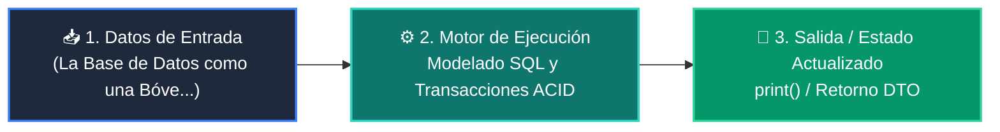

# 📘 Clase 03: Persistencia de Datos: Modelado SQL y Transacciones ACID

<div class="grid cards" markdown>

-   :material-bookmark: **Curso:** Curso 4: Taller Práctico & Proyecto Final Integrador (CLASE 03)
-   :material-signal-cellular-outline: **Nivel:** `Nivel 4 - Integrador`
-   :material-lightbulb-on: **Metáfora Central:** *«La Base de Datos como una Bóveda Acorazada para la Información»*
-   :material-file-pdf-box: **Manual PDF Oficial:** [Descargar clase-03-persistencia-sql-transacciones.pdf](https://github.com/wisrovi/wisrovi-python/raw/main/04-proyecto-final/clase-03-persistencia-sql-transacciones/clase-03-persistencia-sql-transacciones.pdf)

</div>

<div align="center" style="margin: 1rem 0;" markdown>

[](https://colab.research.google.com/github/wisrovi/wisrovi-python/blob/main/04-proyecto-final/clase-03-persistencia-sql-transacciones/notebook/clase-03-persistencia-sql-transacciones.ipynb)
[](https://github.com/wisrovi/wisrovi-python/tree/main/04-proyecto-final/clase-03-persistencia-sql-transacciones)

</div>

---

## 1. 💡 Fundamentación Teórica y Modelo Mental


!!! note "🌟 Modelo Mental de la Sesión: «La Base de Datos como una Bóveda Acorazada para la Información»"
    Una transacción ACID es como una transferencia bancaria: o se descuenta de una cuenta y se acredita en la otra, o se cancela todo.

### Principios Fundamentales de la Sesión


!!! info "⚡ Regla de Oro en Python"
    NUNCA concatenes variables en consultas SQL; usa siempre placeholders (?, %s o :val).

---

## 2. 🗺️ Arquitectura de Ejecución y Diagrama de Flujo



---

## 3. 💻 Código de Implementación Práctica

```python
import sqlite3

class RepositorioUsuarios:
    def __init__(self, db_path: str = "app.db"):
        self.db_path = db_path
        self._crear_tabla()

    def _crear_tabla(self):
        with sqlite3.connect(self.db_path) as conn:
            conn.execute("""
                CREATE TABLE IF NOT EXISTS usuarios (
                    id INTEGER PRIMARY KEY AUTOINCREMENT,
                    nombre TEXT NOT NULL,
                    email TEXT UNIQUE NOT NULL
                )
            """)

    def insertar(self, nombre: str, email: str) -> int:
        with sqlite3.connect(self.db_path) as conn:
            cursor = conn.cursor()
            cursor.execute("INSERT INTO usuarios (nombre, email) VALUES (?, ?)", (nombre, email))
            return cursor.lastrowid

repo = RepositorioUsuarios(":memory:")
uid = repo.insertar("Wisrovi Developer", "wisrovi@dev.com")
print(f"Usuario insertado con ID: {uid}")
```

---

## 4. 🛡️ Buenas Prácticas, Gotchas y Prevención de Errores

!!! warning "⚠️ Trampa Frecuente (Gotcha)"
    Formatear strings con f-strings en SQL permite a atacantes ejecutar comandos destructivos (ej. ' OR 1=1; DROP TABLE...).

=== "❌ Antipatrón / Código Inadecuado"
    ```python
    cursor.execute(f'SELECT * FROM users WHERE email = \'{email}\'')  # ❌ Vulnerable a SQL Injection
    ```

=== "✅ Patrón Recomendado / Pythonic"
    ```python
    cursor.execute('SELECT * FROM users WHERE email = ?', (email,))    # ✅ 100% Seguro
    ```

!!! tip "🔧 Consejo de Ingeniería"
    

---

## 5. 🏋️ Desafío Práctico de la Clase

!!! example "🎯 Enunciado del Reto"
    **Crea una tabla 'pedidos' vinculada por clave foránea (FOREIGN KEY) a la tabla de usuarios.**

Para resolver este ejercicio en tu entorno:
1. Abre el archivo `ejercicios/reto.py` de esta clase en Visual Studio Code.
2. Implementa tu solución cumpliendo los requisitos y contratos de tipo.
3. Valida tus resultados ejecutando las pruebas unitarias:
   ```bash
   pytest tests/curso_04/test_clase_03_persistencia_sql_transacciones.py
   ```

---

## 6. 📚 Fuentes y Bibliografía Recomendada

*   [📖 Documentación Oficial de Python 3](https://docs.python.org/3/)
*   [📑 Guía de Estilo Oficial PEP 8](https://peps.python.org/pep-0008/)
*   [📦 Ecosistema Open Source wisrovi en PyPI](https://pypi.org/user/wisrovi/)
