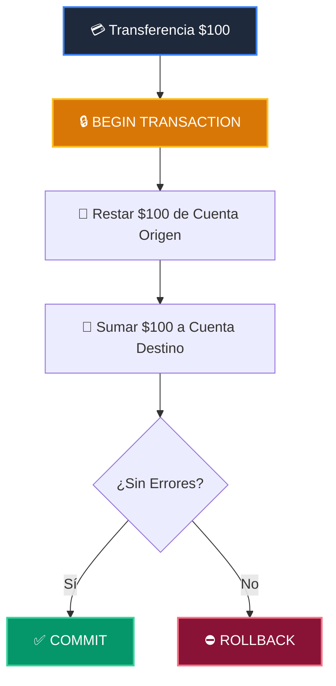

# 📘 Clase 03: Persistencia de Datos: Modelado SQL y Transacciones ACID

<div class="grid cards" markdown>

-   :material-bookmark: **Curso:** Curso 4: Taller Práctico & Proyecto Final Integrador (CLASE 03)
-   :material-signal-cellular-outline: **Nivel:** `Nivel 4 - Integrador`
-   :material-lightbulb-on: **Metáfora Central:** *«La Bóveda Acorazada y el Libro Mayor ACID»*
-   :material-laptop: **Wisrovi Studio (Local):** [🚀 Abrir Reto](http://127.0.0.1:8501/?course=4&class=3) &bull; [👨‍🏫 Modo Tutor](http://127.0.0.1:8501/tutor?course=4&class=3)
-   :material-file-pdf-box: **Manual PDF Oficial:** [Descargar clase-03-persistencia-sql-transacciones.pdf](https://github.com/wisrovi/wisrovi-python/raw/main/04-proyecto-final/clase-03-persistencia-sql-transacciones/clase-03-persistencia-sql-transacciones.pdf)

</div>

<div align="center" style="margin: 1rem 0;" markdown>

[](https://colab.research.google.com/github/wisrovi/wisrovi-python/blob/main/04-proyecto-final/clase-03-persistencia-sql-transacciones/notebook/clase-03-persistencia-sql-transacciones.ipynb)
[-0284c7?logo=python&logoColor=white)](http://127.0.0.1:8501/?course=4&class=3)
[](https://github.com/wisrovi/wisrovi-python/tree/main/04-proyecto-final/clase-03-persistencia-sql-transacciones)

</div>

---

## 1. 💡 Fundamentación Teórica y Modelo Mental

Garantía de integridad y consistencia en el almacenamiento relacional:
1. **Propiedades ACID**: Atomicidad, Consistencia, Aislamiento y Durabilidad.
2. **Transacciones SQL**: `BEGIN`, `COMMIT`, `ROLLBACK` para operaciones que no admiten estados intermedios.
3. **SQLite en Memoria / Postgres**: Ejecución segura de consultas parametrizadas contra inyecciones SQL.

!!! note "🌟 Modelo Mental de la Sesión: «La Bóveda Acorazada y el Libro Mayor ACID»"
    En esta sesión anclamos el aprendizaje en la metáfora del mundo real para visualizar cómo fluyen las estructuras de datos y el flujo de ejecución en la memoria.

---

## 2. 🗺️ Arquitectura de Ejecución y Diagrama de Flujo



---

## 3. 💻 Código de Implementación Práctica

=== "🚀 Demostración en Vivo"
    ```python
    import sqlite3

conn = sqlite3.connect(":memory:")
conn.execute("CREATE TABLE cuentas (id TEXT PRIMARY KEY, saldo REAL)")
conn.execute("INSERT INTO cuentas VALUES ('A', 500.0), ('B', 200.0)")
conn.commit()

cursor = conn.cursor()
cursor.execute("SELECT * FROM cuentas")
print("Cuentas iniciales:", cursor.fetchall())
    ```

=== "🔬 Arenero de Exploración de Memoria (RAM)"
    ```python
    import sqlite3
c = sqlite3.connect(":memory:")
c.execute("CREATE TABLE logs (msg TEXT)")
c.execute("INSERT INTO logs VALUES ('OK')")
print("Total logs:", c.execute("SELECT count(*) FROM logs").fetchone()[0])
    ```

---

## 4. 🛡️ Buenas Prácticas PEP 8: Antipatrones vs Código Pythonic

!!! warning "⚠️ Cuidado con los Antipatrones"
    

=== "❌ Antipatrón / Código Inadecuado"
    ```python
    cursor.execute(f'SELECT * FROM users WHERE email = \'{email}\'')  # ❌ Vulnerable a SQL Injection
    ```

=== "✅ Patrón Recomendado / Pythonic"
    ```python
    cursor.execute('SELECT * FROM users WHERE email = ?', (email,))    # ✅ 100% Seguro
    ```

---

## 5. 🏋️ Desafío Práctico de la Clase

!!! example "🎯 Enunciado del Reto"
    **Crea una función `registrar_transaccion_sqlite(conn: sqlite3.Connection, origen: str, destino: str, monto: float) -> bool` que ejecute de forma transaccional una transferencia descontando `monto` de `origen` y sumando a `destino`, haciendo `commit()` y retornando `True`.**

!!! tip "⚡ Resolución Híbrida en 1 Clic (Local + Web)"
    Si tienes ejecutando `wisrovi ui` en tu terminal local, puedes [🚀 Abrir este Reto directamente en tu Studio Local (127.0.0.1:8501)](http://127.0.0.1:8501/?course=4&class=3) para escribir tu código con auto-formateo AST, inspeccionar variables en el Heap/Stack y evaluarlo con pruebas en tiempo real.

=== "💻 Plantilla de Inicio (Starter Code)"
    ```python
    import sqlite3

def registrar_transaccion_sqlite(conn: sqlite3.Connection, origen: str, destino: str, monto: float) -> bool:
    # ✍️ Ejecuta la transferencia atómica con commit
    cursor = conn.cursor()
    try:
        cursor.execute("UPDATE cuentas SET saldo = saldo - ? WHERE id = ?", (monto, origen))
        cursor.execute("UPDATE cuentas SET saldo = saldo + ? WHERE id = ?", (monto, destino))
        conn.commit()
        return True
    except Exception:
        conn.rollback()
        return False

    ```

??? info "💡 Pista Socrática 1"
    💡 Pista 1: Usa `UPDATE cuentas SET saldo = saldo - ? WHERE id = ?` para el origen.

??? info "💡 Pista Socrática 2"
    💡 Pista 2: Usa `UPDATE cuentas SET saldo = saldo + ? WHERE id = ?` para el destino.

??? info "💡 Pista Socrática 3"
    💡 Pista 3: Llama a `conn.commit()` y retorna `True`.


Para resolver este ejercicio en tu entorno:
1. Abre el archivo `ejercicios/reto.py` de esta clase en Visual Studio Code o utiliza `wisrovi ui` / `wisrovi tutor`.
2. Implementa tu solución cumpliendo los requisitos y contratos de tipado.
3. Valida tus resultados ejecutando las pruebas unitarias:
   ```bash
   pytest tests/curso_04/test_clase_03_persistencia_sql_transacciones.py
   ```

---


## 6. 📚 Fuentes y Bibliografía Recomendada

*   [📖 Documentación Oficial de Python 3](https://docs.python.org/3/)
*   [📑 Guía de Estilo Oficial PEP 8](https://peps.python.org/pep-0008/)
*   [📦 Ecosistema Open Source wisrovi en PyPI](https://pypi.org/user/wisrovi/)
