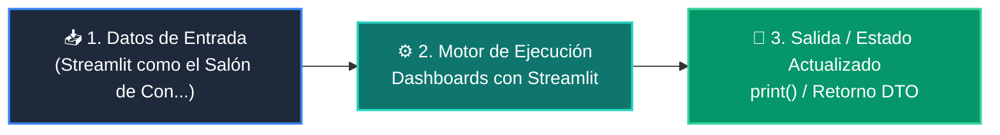

# 📘 Clase 04: Desarrollo del Frontend: Dashboards con Streamlit

<div class="grid cards" markdown>

-   :material-bookmark: **Curso:** Curso 4: Taller Práctico & Proyecto Final Integrador (CLASE 04)
-   :material-signal-cellular-outline: **Nivel:** `Nivel 4 - Integrador`
-   :material-lightbulb-on: **Metáfora Central:** *«Streamlit como el Salón de Control Visual para tu Backend de Python»*
-   :material-file-pdf-box: **Manual PDF Oficial:** [Descargar clase-04-frontend-streamlit.pdf](https://github.com/wisrovi/wisrovi-python/raw/main/04-proyecto-final/clase-04-frontend-streamlit/clase-04-frontend-streamlit.pdf)

</div>

<div align="center" style="margin: 1rem 0;" markdown>

[](https://colab.research.google.com/github/wisrovi/wisrovi-python/blob/main/04-proyecto-final/clase-04-frontend-streamlit/notebook/clase-04-frontend-streamlit.ipynb)
[](https://github.com/wisrovi/wisrovi-python/tree/main/04-proyecto-final/clase-04-frontend-streamlit)

</div>

---

## 1. 💡 Fundamentación Teórica y Modelo Mental


!!! note "🌟 Modelo Mental de la Sesión: «Streamlit como el Salón de Control Visual para tu Backend de Python»"
    Es como un tablero de mandos de automóvil donde cada botón y pantalla se conecta directamente al motor de tu backend.

### Principios Fundamentales de la Sesión


!!! info "⚡ Regla de Oro en Python"
    Usa st.session_state para almacenar sesiones de chat o datos de formularios sin perderlos al hacer clic.

---

## 2. 🗺️ Arquitectura de Ejecución y Diagrama de Flujo



---

## 3. 💻 Código de Implementación Práctica

```python
import streamlit as st

st.set_page_config(page_title="Panel de Control", page_icon="🚀")
st.title("🚀 Panel de Gestión de Leads")

if "leads" not in st.session_state:
    st.session_state.leads = []

with st.form("form_lead"):
    nombre = st.text_input("Nombre completo")
    email = st.text_input("Correo electrónico")
    enviado = st.form_submit_button("Guardar Lead")
    
    if enviado and nombre:
        st.session_state.leads.append({"nombre": nombre, "email": email})
        st.success(f"Lead {nombre} registrado con éxito.")

st.write(f"Total registrados: {len(st.session_state.leads)}")
```

---

## 4. 🛡️ Buenas Prácticas, Gotchas y Prevención de Errores

!!! warning "⚠️ Trampa Frecuente (Gotcha)"
    Cargar modelos pesados o archivos grandes en cada interacción ralentiza la aplicación.

=== "❌ Antipatrón / Código Inadecuado"
    ```python
    modelo = cargar_modelo_pesado_2gb()  # ❌ Se recarga en cada clic
    ```

=== "✅ Patrón Recomendado / Pythonic"
    ```python
    @st.cache_resource
def get_model(): return cargar_modelo()  # ✅ Se ejecuta una sola vez en caché
    ```

!!! tip "🔧 Consejo de Ingeniería"
    

---

## 5. 🏋️ Desafío Práctico de la Clase

!!! example "🎯 Enunciado del Reto"
    **Crea una vista con st.tabs para alternar entre el formulario de registro y la tabla de datos.**

Para resolver este ejercicio en tu entorno:
1. Abre el archivo `ejercicios/reto.py` de esta clase en Visual Studio Code.
2. Implementa tu solución cumpliendo los requisitos y contratos de tipo.
3. Valida tus resultados ejecutando las pruebas unitarias:
   ```bash
   pytest tests/curso_04/test_clase_04_frontend_streamlit.py
   ```

---

## 6. 📚 Fuentes y Bibliografía Recomendada

*   [📖 Documentación Oficial de Python 3](https://docs.python.org/3/)
*   [📑 Guía de Estilo Oficial PEP 8](https://peps.python.org/pep-0008/)
*   [📦 Ecosistema Open Source wisrovi en PyPI](https://pypi.org/user/wisrovi/)
