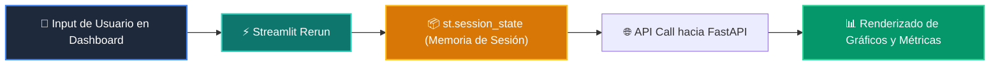

# 📘 Clase 04: Desarrollo del Frontend: Dashboards con Streamlit

<div class="grid cards" markdown>

-   :material-bookmark: **Curso:** Curso 4: Taller Práctico & Proyecto Final Integrador (CLASE 04)
-   :material-signal-cellular-outline: **Nivel:** `Nivel 4 - Integrador`
-   :material-lightbulb-on: **Metáfora Central:** *«El Tablero de Mandos Interactivo y los Componentes Reactivos»*
-   :material-laptop: **Wisrovi Studio (Local):** [🚀 Abrir Reto](http://127.0.0.1:8501/?course=4&class=4) &bull; [👨‍🏫 Modo Tutor](http://127.0.0.1:8501/tutor?course=4&class=4)
-   :material-file-pdf-box: **Manual PDF Oficial:** [Descargar clase-04-frontend-streamlit.pdf](https://github.com/wisrovi/wisrovi-python/raw/main/04-proyecto-final/clase-04-frontend-streamlit/clase-04-frontend-streamlit.pdf)

</div>

<div align="center" style="margin: 1rem 0;" markdown>

[](https://colab.research.google.com/github/wisrovi/wisrovi-python/blob/main/04-proyecto-final/clase-04-frontend-streamlit/notebook/clase-04-frontend-streamlit.ipynb)
[-0284c7?logo=python&logoColor=white)](http://127.0.0.1:8501/?course=4&class=4)
[](https://github.com/wisrovi/wisrovi-python/tree/main/04-proyecto-final/clase-04-frontend-streamlit)

</div>

---

## 1. 💡 Fundamentación Teórica y Modelo Mental

Prototipado rápido y visualización de datos reactiva con Streamlit:
1. **Estado de Sesión (`st.session_state`)**: Persistir estado entre reruns de la interfaz.
2. **Widgets y Métricas**: `st.metric`, `st.chat_input`, `st.chat_message` para interfaces conversacionales.
3. **Consumo de Backend**: Llamadas HTTP vía `requests` o SDK interno hacia el servidor FastAPI.

!!! note "🌟 Modelo Mental de la Sesión: «El Tablero de Mandos Interactivo y los Componentes Reactivos»"
    En esta sesión anclamos el aprendizaje en la metáfora del mundo real para visualizar cómo fluyen las estructuras de datos y el flujo de ejecución en la memoria.

---

## 2. 🗺️ Arquitectura de Ejecución y Diagrama de Flujo



---

## 3. 💻 Código de Implementación Práctica

=== "🚀 Demostración en Vivo"
    ```python
    def preparar_session_state(usuario: str, rol: str) -> dict:
    return {
        "usuario": usuario,
        "rol": rol,
        "mensajes": [],
        "autenticado": True
    }

print("Estado de sesión inicializado:", preparar_session_state("Wisrovi", "Admin"))
    ```

=== "🔬 Arenero de Exploración de Memoria (RAM)"
    ```python
    metricas = {"usuarios_activos": 1250, "latencia_ms": 15.4}
print("Métricas para dashboard:", metricas)
    ```

---

## 4. 🛡️ Buenas Prácticas PEP 8: Antipatrones vs Código Pythonic

!!! warning "⚠️ Cuidado con los Antipatrones"
    

=== "❌ Antipatrón / Código Inadecuado"
    ```python
    modelo = cargar_modelo_pesado_2gb()  # ❌ Se recarga en cada clic
    ```

=== "✅ Patrón Recomendado / Pythonic"
    ```python
    @st.cache_resource
def get_model(): return cargar_modelo()  # ✅ Se ejecuta una sola vez en caché
    ```

---

## 5. 🏋️ Desafío Práctico de la Clase

!!! example "🎯 Enunciado del Reto"
    **Crea una función `preparar_estado_dashboard(usuario: str, metricas: dict) -> dict` que devuelva un diccionario con las claves: 'usuario', 'metricas', 'mensajes' (lista vacía) y 'listo: True'.**

!!! tip "⚡ Resolución Híbrida en 1 Clic (Local + Web)"
    Si tienes ejecutando `wisrovi ui` en tu terminal local, puedes [🚀 Abrir este Reto directamente en tu Studio Local (127.0.0.1:8501)](http://127.0.0.1:8501/?course=4&class=4) para escribir tu código con auto-formateo AST, inspeccionar variables en el Heap/Stack y evaluarlo con pruebas en tiempo real.

=== "💻 Plantilla de Inicio (Starter Code)"
    ```python
    def preparar_estado_dashboard(usuario: str, metricas: dict) -> dict:
    # ✍️ Estructura el diccionario de sesión para Streamlit
    return {
        "usuario": usuario,
        "metricas": metricas,
        "mensajes": [],
        "listo": True
    }

    ```

??? info "💡 Pista Socrática 1"
    💡 Pista 1: Asigna `usuario` a `'usuario'` y `metricas` a `'metricas'`.

??? info "💡 Pista Socrática 2"
    💡 Pista 2: Inicializa `'mensajes': []` como lista vacía.

??? info "💡 Pista Socrática 3"
    💡 Pista 3: Incluye `'listo': True` y retorna el diccionario.


Para resolver este ejercicio en tu entorno:
1. Abre el archivo `ejercicios/reto.py` de esta clase en Visual Studio Code o utiliza `wisrovi ui` / `wisrovi tutor`.
2. Implementa tu solución cumpliendo los requisitos y contratos de tipado.
3. Valida tus resultados ejecutando las pruebas unitarias:
   ```bash
   pytest tests/curso_04/test_clase_04_frontend_streamlit.py
   ```

---


## 6. 📚 Fuentes y Bibliografía Recomendada

*   [📖 Documentación Oficial de Python 3](https://docs.python.org/3/)
*   [📑 Guía de Estilo Oficial PEP 8](https://peps.python.org/pep-0008/)
*   [📦 Ecosistema Open Source wisrovi en PyPI](https://pypi.org/user/wisrovi/)
