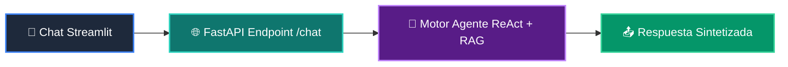

# 📘 Clase 05: Integración del Motor de IA y Agentes en la App

<div class="grid cards" markdown>

-   :material-bookmark: **Curso:** Curso 4: Taller Práctico & Proyecto Final Integrador (CLASE 05)
-   :material-signal-cellular-outline: **Nivel:** `Nivel 4 - Integrador`
-   :material-lightbulb-on: **Metáfora Central:** *«El Asistente Inteligente en Vivo (Conexión Frontend - Agente)»*
-   :material-laptop: **Wisrovi Studio (Local):** [🚀 Abrir Reto](http://127.0.0.1:8501/?course=4&class=5) &bull; [👨‍🏫 Modo Tutor](http://127.0.0.1:8501/tutor?course=4&class=5)
-   :material-file-pdf-box: **Manual PDF Oficial:** [Descargar clase-05-integracion-agente-ia.pdf](https://github.com/wisrovi/wisrovi-python/raw/main/04-proyecto-final/clase-05-integracion-agente-ia/clase-05-integracion-agente-ia.pdf)

</div>

<div align="center" style="margin: 1rem 0;" markdown>

[](https://colab.research.google.com/github/wisrovi/wisrovi-python/blob/main/04-proyecto-final/clase-05-integracion-agente-ia/notebook/clase-05-integracion-agente-ia.ipynb)
[-0284c7?logo=python&logoColor=white)](http://127.0.0.1:8501/?course=4&class=5)
[](https://github.com/wisrovi/wisrovi-python/tree/main/04-proyecto-final/clase-05-integracion-agente-ia)

</div>

---

## 1. 💡 Fundamentación Teórica y Modelo Mental

Conexión end-to-end entre la interfaz de usuario y el motor multi-agente:
1. **Streaming de Respuestas (SSE)**: Enviar tokens en tiempo real al usuario.
2. **Contexto Conversacional**: Inyectar el historial de chat en el prompt del agente.
3. **Manejo de Tiempos de Espera (Timeouts)**: Resiliencia ante latencias de red con fallbacks elegantes.

!!! note "🌟 Modelo Mental de la Sesión: «El Asistente Inteligente en Vivo (Conexión Frontend - Agente)»"
    En esta sesión anclamos el aprendizaje en la metáfora del mundo real para visualizar cómo fluyen las estructuras de datos y el flujo de ejecución en la memoria.

---

## 2. 🗺️ Arquitectura de Ejecución y Diagrama de Flujo



---

## 3. 💻 Código de Implementación Práctica

=== "🚀 Demostración en Vivo"
    ```python
    def sintetizar_respuesta_agente(query: str, docs: list[str]) -> dict:
    contexto = " | ".join(docs)
    return {
        "status": "ok",
        "query": query,
        "respuesta": f"Basado en [{contexto}], la respuesta es óptima."
    }

print(sintetizar_respuesta_agente("¿Qué es Python?", ["Lenguaje interpreted", "Creado por Guido"]))
    ```

=== "🔬 Arenero de Exploración de Memoria (RAM)"
    ```python
    historial = [{"role": "user", "content": "Hola"}, {"role": "assistant", "content": "¡Hola!"}]
print("Longitud del historial:", len(historial))
    ```

---

## 4. 🛡️ Buenas Prácticas PEP 8: Antipatrones vs Código Pythonic

!!! warning "⚠️ Cuidado con los Antipatrones"
    

=== "❌ Antipatrón / Código Inadecuado"
    ```python
    API_KEY = 'sk-123456789'  # ❌ Expuesto en el repositorio
    ```

=== "✅ Patrón Recomendado / Pythonic"
    ```python
    API_KEY = os.environ.get('GEMINI_API_KEY')  # ✅ Variable de entorno segura
    ```

---

## 5. 🏋️ Desafío Práctico de la Clase

!!! example "🎯 Enunciado del Reto"
    **Crea una función `procesar_consulta_agente(consulta: str, contexto_rag: list[str]) -> dict` que valide que la consulta no esté vacía y retorne `{'status': 'ok', 'query': consulta, 'fuentes_usadas': len(contexto_rag), 'respuesta': f'Respuesta a: {consulta}'}`.**

!!! tip "⚡ Resolución Híbrida en 1 Clic (Local + Web)"
    Si tienes ejecutando `wisrovi ui` en tu terminal local, puedes [🚀 Abrir este Reto directamente en tu Studio Local (127.0.0.1:8501)](http://127.0.0.1:8501/?course=4&class=5) para escribir tu código con auto-formateo AST, inspeccionar variables en el Heap/Stack y evaluarlo con pruebas en tiempo real.

=== "💻 Plantilla de Inicio (Starter Code)"
    ```python
    def procesar_consulta_agente(consulta: str, contexto_rag: list[str]) -> dict:
    # ✍️ Procesa la consulta con el contexto RAG
    if not consulta.strip():
        return {"status": "error", "message": "Consulta vacía"}
    return {
        "status": "ok",
        "query": consulta,
        "fuentes_usadas": len(contexto_rag),
        "respuesta": f"Respuesta a: {consulta}"
    }

    ```

??? info "💡 Pista Socrática 1"
    💡 Pista 1: Si `not consulta.strip()`, retorna `status: error`.

??? info "💡 Pista Socrática 2"
    💡 Pista 2: Calcula `fuentes_usadas = len(contexto_rag)`.

??? info "💡 Pista Socrática 3"
    💡 Pista 3: Retorna el diccionario estructurado con status 'ok'.


Para resolver este ejercicio en tu entorno:
1. Abre el archivo `ejercicios/reto.py` de esta clase en Visual Studio Code o utiliza `wisrovi ui` / `wisrovi tutor`.
2. Implementa tu solución cumpliendo los requisitos y contratos de tipado.
3. Valida tus resultados ejecutando las pruebas unitarias:
   ```bash
   pytest tests/curso_04/test_clase_05_integracion_agente_ia.py
   ```

---


## 6. 📚 Fuentes y Bibliografía Recomendada

*   [📖 Documentación Oficial de Python 3](https://docs.python.org/3/)
*   [📑 Guía de Estilo Oficial PEP 8](https://peps.python.org/pep-0008/)
*   [📦 Ecosistema Open Source wisrovi en PyPI](https://pypi.org/user/wisrovi/)
