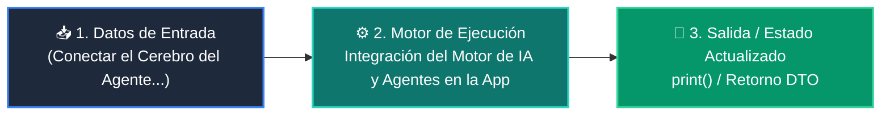

# 📘 Clase 05: Integración del Motor de IA y Agentes en la App

<div class="grid cards" markdown>

-   :material-bookmark: **Curso:** Curso 4: Taller Práctico & Proyecto Final Integrador (CLASE 05)
-   :material-signal-cellular-outline: **Nivel:** `Nivel 4 - Integrador`
-   :material-lightbulb-on: **Metáfora Central:** *«Conectar el Cerebro del Agente al Sistema Nervioso de la Aplicación»*
-   :material-file-pdf-box: **Manual PDF Oficial:** [Descargar clase-05-integracion-agente-ia.pdf](https://github.com/wisrovi/wisrovi-python/raw/main/04-proyecto-final/clase-05-integracion-agente-ia/clase-05-integracion-agente-ia.pdf)

</div>

<div align="center" style="margin: 1rem 0;" markdown>

[](https://colab.research.google.com/github/wisrovi/wisrovi-python/blob/main/04-proyecto-final/clase-05-integracion-agente-ia/notebook/clase-05-integracion-agente-ia.ipynb)
[](https://github.com/wisrovi/wisrovi-python/tree/main/04-proyecto-final/clase-05-integracion-agente-ia)

</div>

---

## 1. 💡 Fundamentación Teórica y Modelo Mental


!!! note "🌟 Modelo Mental de la Sesión: «Conectar el Cerebro del Agente al Sistema Nervioso de la Aplicación»"
    Es como conectar un motor híbrido a un automóvil: debe responder con potencia suave sin tirones para el conductor.

### Principios Fundamentales de la Sesión


!!! info "⚡ Regla de Oro en Python"
    Muestra siempre indicadores visuales de carga (spinners) mientras el agente razona.

---

## 2. 🗺️ Arquitectura de Ejecución y Diagrama de Flujo



---

## 3. 💻 Código de Implementación Práctica

```python
class AgenteService:
    def __init__(self, nombre_bot: str = "WisroviAssistant"):
        self.nombre_bot = nombre_bot

    def procesar_consulta(self, usuario_id: str, prompt: str) -> dict:
        # Lógica de agente con memoria y guardrails
        respuesta = f"[{self.nombre_bot}] He analizado tu solicitud: '{prompt}'. Todo en orden."
        return {
            "usuario_id": usuario_id,
            "respuesta": respuesta,
            "tokens_usados": 42
        }

servicio = AgenteService()
print(servicio.procesar_consulta("usr_1", "Generar balance"))
```

---

## 4. 🛡️ Buenas Prácticas, Gotchas y Prevención de Errores

!!! warning "⚠️ Trampa Frecuente (Gotcha)"
    Escribir las claves de API (OPENAI_API_KEY, GEMINI_API_KEY) en el código del frontend expone tu cuenta.

=== "❌ Antipatrón / Código Inadecuado"
    ```python
    API_KEY = 'sk-123456789'  # ❌ Expuesto en el repositorio
    ```

=== "✅ Patrón Recomendado / Pythonic"
    ```python
    API_KEY = os.environ.get('GEMINI_API_KEY')  # ✅ Variable de entorno segura
    ```

!!! tip "🔧 Consejo de Ingeniería"
    

---

## 5. 🏋️ Desafío Práctico de la Clase

!!! example "🎯 Enunciado del Reto"
    **Implementa un generador 'def stream_respuesta()' que entregue palabras una a una simulando streaming.**

Para resolver este ejercicio en tu entorno:
1. Abre el archivo `ejercicios/reto.py` de esta clase en Visual Studio Code.
2. Implementa tu solución cumpliendo los requisitos y contratos de tipo.
3. Valida tus resultados ejecutando las pruebas unitarias:
   ```bash
   pytest tests/curso_04/test_clase_05_integracion_agente_ia.py
   ```

---

## 6. 📚 Fuentes y Bibliografía Recomendada

*   [📖 Documentación Oficial de Python 3](https://docs.python.org/3/)
*   [📑 Guía de Estilo Oficial PEP 8](https://peps.python.org/pep-0008/)
*   [📦 Ecosistema Open Source wisrovi en PyPI](https://pypi.org/user/wisrovi/)
