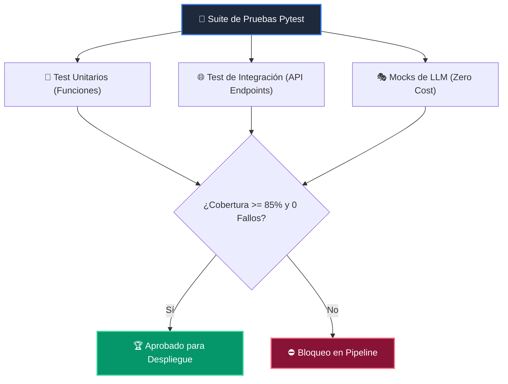

# 📘 Clase 06: Testing Riguroso con Pytest, Mocks y Calidad

<div class="grid cards" markdown>

-   :material-bookmark: **Curso:** Curso 4: Taller Práctico & Proyecto Final Integrador (CLASE 06)
-   :material-signal-cellular-outline: **Nivel:** `Nivel 4 - Integrador`
-   :material-lightbulb-on: **Metáfora Central:** *«El Laboratorio de Control de Calidad y las Pruebas de Estrés»*
-   :material-laptop: **Wisrovi Studio (Local):** [🚀 Abrir Reto](http://127.0.0.1:8501/?course=4&class=6) &bull; [👨‍🏫 Modo Tutor](http://127.0.0.1:8501/tutor?course=4&class=6)
-   :material-file-pdf-box: **Manual PDF Oficial:** [Descargar clase-06-testing-y-calidad.pdf](https://github.com/wisrovi/wisrovi-python/raw/main/04-proyecto-final/clase-06-testing-y-calidad/clase-06-testing-y-calidad.pdf)

</div>

<div align="center" style="margin: 1rem 0;" markdown>

[](https://colab.research.google.com/github/wisrovi/wisrovi-python/blob/main/04-proyecto-final/clase-06-testing-y-calidad/notebook/clase-06-testing-y-calidad.ipynb)
[-0284c7?logo=python&logoColor=white)](http://127.0.0.1:8501/?course=4&class=6)
[](https://github.com/wisrovi/wisrovi-python/tree/main/04-proyecto-final/clase-06-testing-y-calidad)

</div>

---

## 1. 💡 Fundamentación Teórica y Modelo Mental

Garantía de calidad mediante pruebas automatizadas exhaustivas:
1. **Pytest & Fixtures**: Reutilización de estados de prueba limpios y desacoplados.
2. **Mocks & Spies (`unittest.mock`)**: Simulación de llamadas a APIs externas sin gastar tokens reales.
3. **Métricas de Cobertura (Coverage)**: Asegurar un mínimo del 85%+ de líneas evaluadas por la suite.

!!! note "🌟 Modelo Mental de la Sesión: «El Laboratorio de Control de Calidad y las Pruebas de Estrés»"
    En esta sesión anclamos el aprendizaje en la metáfora del mundo real para visualizar cómo fluyen las estructuras de datos y el flujo de ejecución en la memoria.

---

## 2. 🗺️ Arquitectura de Ejecución y Diagrama de Flujo



---

## 3. 💻 Código de Implementación Práctica

=== "🚀 Demostración en Vivo"
    ```python
    def evaluar_calidad_demo(passed: int, total: int, coverage: float) -> bool:
    return (passed == total) and (coverage >= 85.0)

print("¿Calidad certificada?:", evaluar_calidad_demo(34, 34, 94.5))
    ```

=== "🔬 Arenero de Exploración de Memoria (RAM)"
    ```python
    assert 2 + 2 == 4, "Aserción básica válida"
print("Aserción completada.")
    ```

---

## 4. 🛡️ Buenas Prácticas PEP 8: Antipatrones vs Código Pythonic

!!! warning "⚠️ Cuidado con los Antipatrones"
    

=== "❌ Antipatrón / Código Inadecuado"
    ```python
    def test_llm():
    res = llamar_api_real_openai()  # ❌ Lento, frágil y cuesta dinero
    ```

=== "✅ Patrón Recomendado / Pythonic"
    ```python
    def test_llm(mocker):
    mocker.patch('llm.call', return_value='Respuesta Mock')  # ✅ Rápido y determinista
    ```

---

## 5. 🏋️ Desafío Práctico de la Clase

!!! example "🎯 Enunciado del Reto"
    **Crea una función `suite_calidad_codigo(cobertura_pct: float, tests_fallidos: int) -> tuple[bool, str]` que retorne `(True, 'Certificado')` si cobertura_pct >= 85.0 y tests_fallidos == 0, o `(False, 'Calidad insuficiente')` en caso contrario.**

!!! tip "⚡ Resolución Híbrida en 1 Clic (Local + Web)"
    Si tienes ejecutando `wisrovi ui` en tu terminal local, puedes [🚀 Abrir este Reto directamente en tu Studio Local (127.0.0.1:8501)](http://127.0.0.1:8501/?course=4&class=6) para escribir tu código con auto-formateo AST, inspeccionar variables en el Heap/Stack y evaluarlo con pruebas en tiempo real.

=== "💻 Plantilla de Inicio (Starter Code)"
    ```python
    def suite_calidad_codigo(cobertura_pct: float, tests_fallidos: int) -> tuple[bool, str]:
    # ✍️ Valida cobertura >= 85.0 y tests_fallidos == 0
    if cobertura_pct >= 85.0 and tests_fallidos == 0:
        return (True, "Certificado")
    return (False, "Calidad insuficiente")

    ```

??? info "💡 Pista Socrática 1"
    💡 Pista 1: Comprueba `cobertura_pct >= 85.0 and tests_fallidos == 0`.

??? info "💡 Pista Socrática 2"
    💡 Pista 2: Si cumple, retorna `(True, 'Certificado')`.

??? info "💡 Pista Socrática 3"
    💡 Pista 3: En caso contrario retorna `(False, 'Calidad insuficiente')`.


Para resolver este ejercicio en tu entorno:
1. Abre el archivo `ejercicios/reto.py` de esta clase en Visual Studio Code o utiliza `wisrovi ui` / `wisrovi tutor`.
2. Implementa tu solución cumpliendo los requisitos y contratos de tipado.
3. Valida tus resultados ejecutando las pruebas unitarias:
   ```bash
   pytest tests/curso_04/test_clase_06_testing_y_calidad.py
   ```

---


## 6. 📚 Fuentes y Bibliografía Recomendada

*   [📖 Documentación Oficial de Python 3](https://docs.python.org/3/)
*   [📑 Guía de Estilo Oficial PEP 8](https://peps.python.org/pep-0008/)
*   [📦 Ecosistema Open Source wisrovi en PyPI](https://pypi.org/user/wisrovi/)
