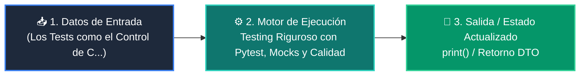

# 📘 Clase 06: Testing Riguroso con Pytest, Mocks y Calidad

<div class="grid cards" markdown>

-   :material-bookmark: **Curso:** Curso 4: Taller Práctico & Proyecto Final Integrador (CLASE 06)
-   :material-signal-cellular-outline: **Nivel:** `Nivel 4 - Integrador`
-   :material-lightbulb-on: **Metáfora Central:** *«Los Tests como el Control de Calidad y Pruebas de Choque de un Vehículo»*
-   :material-file-pdf-box: **Manual PDF Oficial:** [Descargar clase-06-testing-y-calidad.pdf](https://github.com/wisrovi/wisrovi-python/raw/main/04-proyecto-final/clase-06-testing-y-calidad/clase-06-testing-y-calidad.pdf)

</div>

<div align="center" style="margin: 1rem 0;" markdown>

[](https://colab.research.google.com/github/wisrovi/wisrovi-python/blob/main/04-proyecto-final/clase-06-testing-y-calidad/notebook/clase-06-testing-y-calidad.ipynb)
[](https://github.com/wisrovi/wisrovi-python/tree/main/04-proyecto-final/clase-06-testing-y-calidad)

</div>

---

## 1. 💡 Fundamentación Teórica y Modelo Mental


!!! note "🌟 Modelo Mental de la Sesión: «Los Tests como el Control de Calidad y Pruebas de Choque de un Vehículo»"
    Hacer tests es como las pruebas de choque de los coches: verificas que los frenos funcionan antes de salir a la autopista.

### Principios Fundamentales de la Sesión


!!! info "⚡ Regla de Oro en Python"
    Tus tests nunca deben depender de servicios externos reales ni requerir conexión a internet.

---

## 2. 🗺️ Arquitectura de Ejecución y Diagrama de Flujo



---

## 3. 💻 Código de Implementación Práctica

```python
def calcular_subtotal(items: list[dict]) -> float:
    return sum(i["precio"] * i["cantidad"] for i in items)

def test_calculo_subtotal():
    carrito = [
        {"precio": 10.0, "cantidad": 2},
        {"precio": 5.0, "cantidad": 1}
    ]
    assert calcular_subtotal(carrito) == 25.0

def test_carrito_vacio():
    assert calcular_subtotal([]) == 0.0

print("Ejecutando tests...")
test_calculo_subtotal()
test_carrito_vacio()
print("✅ Todos los tests pasaron exitosamente.")
```

---

## 4. 🛡️ Buenas Prácticas, Gotchas y Prevención de Errores

!!! warning "⚠️ Trampa Frecuente (Gotcha)"
    Hacer que los tests llamen a APIs reales falla si no hay internet y consume cuota de pago.

=== "❌ Antipatrón / Código Inadecuado"
    ```python
    def test_llm():
    res = llamar_api_real_openai()  # ❌ Lento, frágil y cuesta dinero
    ```

=== "✅ Patrón Recomendado / Pythonic"
    ```python
    def test_llm(mocker):
    mocker.patch('llm.call', return_value='Respuesta Mock')  # ✅ Rápido y determinista
    ```

!!! tip "🔧 Consejo de Ingeniería"
    

---

## 5. 🏋️ Desafío Práctico de la Clase

!!! example "🎯 Enunciado del Reto"
    **Escribe un test parametrizado con @pytest.mark.parametrize para validar 5 casos de cálculo de IVA.**

Para resolver este ejercicio en tu entorno:
1. Abre el archivo `ejercicios/reto.py` de esta clase en Visual Studio Code.
2. Implementa tu solución cumpliendo los requisitos y contratos de tipo.
3. Valida tus resultados ejecutando las pruebas unitarias:
   ```bash
   pytest tests/curso_04/test_clase_06_testing_y_calidad.py
   ```

---

## 6. 📚 Fuentes y Bibliografía Recomendada

*   [📖 Documentación Oficial de Python 3](https://docs.python.org/3/)
*   [📑 Guía de Estilo Oficial PEP 8](https://peps.python.org/pep-0008/)
*   [📦 Ecosistema Open Source wisrovi en PyPI](https://pypi.org/user/wisrovi/)
