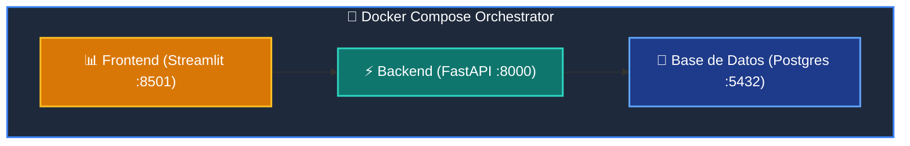

# 📘 Clase 07: Containerización Profesional con Docker y Compose

<div class="grid cards" markdown>

-   :material-bookmark: **Curso:** Curso 4: Taller Práctico & Proyecto Final Integrador (CLASE 07)
-   :material-signal-cellular-outline: **Nivel:** `Nivel 4 - Integrador`
-   :material-lightbulb-on: **Metáfora Central:** *«El Contenedor de Carga Estandarizado (Reproducibilidad Total)»*
-   :material-laptop: **Wisrovi Studio (Local):** [🚀 Abrir Reto](http://127.0.0.1:8501/?course=4&class=7) &bull; [👨‍🏫 Modo Tutor](http://127.0.0.1:8501/tutor?course=4&class=7)
-   :material-file-pdf-box: **Manual PDF Oficial:** [Descargar clase-07-docker-y-compose.pdf](https://github.com/wisrovi/wisrovi-python/raw/main/04-proyecto-final/clase-07-docker-y-compose/clase-07-docker-y-compose.pdf)

</div>

<div align="center" style="margin: 1rem 0;" markdown>

[](https://colab.research.google.com/github/wisrovi/wisrovi-python/blob/main/04-proyecto-final/clase-07-docker-y-compose/notebook/clase-07-docker-y-compose.ipynb)
[-0284c7?logo=python&logoColor=white)](http://127.0.0.1:8501/?course=4&class=7)
[](https://github.com/wisrovi/wisrovi-python/tree/main/04-proyecto-final/clase-07-docker-y-compose)

</div>

---

## 1. 💡 Fundamentación Teórica y Modelo Mental

Empaquetado inmutable y orquestación multi-servicio para producción:
1. **Dockerfile Multi-Stage**: Reducción drástica del tamaño de la imagen final y seguridad non-root.
2. **Docker Compose**: Orquestación coordinada de backend (FastAPI), frontend (Streamlit) y base de datos (Postgres).
3. **Healthchecks & Variables de Entorno**: Configuración estandarizada vía `.env`.

!!! note "🌟 Modelo Mental de la Sesión: «El Contenedor de Carga Estandarizado (Reproducibilidad Total)»"
    En esta sesión anclamos el aprendizaje en la metáfora del mundo real para visualizar cómo fluyen las estructuras de datos y el flujo de ejecución en la memoria.

---

## 2. 🗺️ Arquitectura de Ejecución y Diagrama de Flujo



---

## 3. 💻 Código de Implementación Práctica

=== "🚀 Demostración en Vivo"
    ```python
    def generar_compose_yaml(servicios: list[str]) -> str:
    return f"""version: '3.8'
services:
  """ + "\n  ".join(f"{s}:\n    image: wisrovi/{s}:latest" for s in servicios)

print(generar_compose_yaml(["fastapi_app", "streamlit_ui"]))
    ```

=== "🔬 Arenero de Exploración de Memoria (RAM)"
    ```python
    servicios = ["backend", "frontend", "db"]
print("Servicios listos para compose:", servicios)
    ```

---

## 4. 🛡️ Buenas Prácticas PEP 8: Antipatrones vs Código Pythonic

!!! warning "⚠️ Cuidado con los Antipatrones"
    

=== "❌ Antipatrón / Código Inadecuado"
    ```python
    FROM ubuntu:latest  # ❌ Imagen pesada y lenta de descargar
    ```

=== "✅ Patrón Recomendado / Pythonic"
    ```python
    FROM python:3.11-slim  # ✅ Ligera (~150 MB) y rápida
    ```

---

## 5. 🏋️ Desafío Práctico de la Clase

!!! example "🎯 Enunciado del Reto"
    **Crea una función `generar_dockerfile_python(version: str = '3.11-slim', port: int = 8000) -> str` que retorne una cadena con un Dockerfile estándar conteniendo las directivas: `FROM python:{version}`, `WORKDIR /app`, `EXPOSE {port}` y `CMD ["uvicorn", "main:app"]`.**

!!! tip "⚡ Resolución Híbrida en 1 Clic (Local + Web)"
    Si tienes ejecutando `wisrovi ui` en tu terminal local, puedes [🚀 Abrir este Reto directamente en tu Studio Local (127.0.0.1:8501)](http://127.0.0.1:8501/?course=4&class=7) para escribir tu código con auto-formateo AST, inspeccionar variables en el Heap/Stack y evaluarlo con pruebas en tiempo real.

=== "💻 Plantilla de Inicio (Starter Code)"
    ```python
    def generar_dockerfile_python(version: str = "3.11-slim", port: int = 8000) -> str:
    # ✍️ Genera el contenido del Dockerfile
    return f"""FROM python:{version}
WORKDIR /app
COPY . /app
EXPOSE {port}
CMD ["uvicorn", "main:app"]"""

    ```

??? info "💡 Pista Socrática 1"
    💡 Pista 1: Incluye `FROM python:{version}` y `WORKDIR /app`.

??? info "💡 Pista Socrática 2"
    💡 Pista 2: Incluye `EXPOSE {port}` con el puerto parametrizado.

??? info "💡 Pista Socrática 3"
    💡 Pista 3: Retorna la cadena completa formateada.


Para resolver este ejercicio en tu entorno:
1. Abre el archivo `ejercicios/reto.py` de esta clase en Visual Studio Code o utiliza `wisrovi ui` / `wisrovi tutor`.
2. Implementa tu solución cumpliendo los requisitos y contratos de tipado.
3. Valida tus resultados ejecutando las pruebas unitarias:
   ```bash
   pytest tests/curso_04/test_clase_07_docker_y_compose.py
   ```

---


## 6. 📚 Fuentes y Bibliografía Recomendada

*   [📖 Documentación Oficial de Python 3](https://docs.python.org/3/)
*   [📑 Guía de Estilo Oficial PEP 8](https://peps.python.org/pep-0008/)
*   [📦 Ecosistema Open Source wisrovi en PyPI](https://pypi.org/user/wisrovi/)
