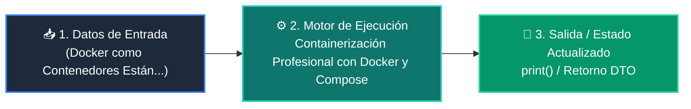

# 📘 Clase 07: Containerización Profesional con Docker y Compose

<div class="grid cards" markdown>

-   :material-bookmark: **Curso:** Curso 4: Taller Práctico & Proyecto Final Integrador (CLASE 07)
-   :material-signal-cellular-outline: **Nivel:** `Nivel 4 - Integrador`
-   :material-lightbulb-on: **Metáfora Central:** *«Docker como Contenedores Estándar de Carga Marítima para Software»*
-   :material-file-pdf-box: **Manual PDF Oficial:** [Descargar clase-07-docker-y-compose.pdf](https://github.com/wisrovi/wisrovi-python/raw/main/04-proyecto-final/clase-07-docker-y-compose/clase-07-docker-y-compose.pdf)

</div>

<div align="center" style="margin: 1rem 0;" markdown>

[](https://colab.research.google.com/github/wisrovi/wisrovi-python/blob/main/04-proyecto-final/clase-07-docker-y-compose/notebook/clase-07-docker-y-compose.ipynb)
[](https://github.com/wisrovi/wisrovi-python/tree/main/04-proyecto-final/clase-07-docker-y-compose)

</div>

---

## 1. 💡 Fundamentación Teórica y Modelo Mental


!!! note "🌟 Modelo Mental de la Sesión: «Docker como Contenedores Estándar de Carga Marítima para Software»"
    Un contenedor Docker es como un contenedor de barco: no importa si va en tren o camión, su contenido viaja aislado y seguro.

### Principios Fundamentales de la Sesión


!!! info "⚡ Regla de Oro en Python"
    Usa imágenes base ligeras (ej. python:3.11-slim) para reducir el tamaño y vulnerabilidades.

---

## 2. 🗺️ Arquitectura de Ejecución y Diagrama de Flujo



---

## 3. 💻 Código de Implementación Práctica

```python
DOCKERFILE_EXAMPLE = """FROM python:3.11-slim
WORKDIR /app
COPY requirements.txt .
RUN pip install --no-cache-dir -r requirements.txt
COPY . .
EXPOSE 8000
CMD ["uvicorn", "main:app", "--host", "0.0.0.0", "--port", "8000"]"""

print("Dockerfile de producción configurado:")
print(DOCKERFILE_EXAMPLE)
```

---

## 4. 🛡️ Buenas Prácticas, Gotchas y Prevención de Errores

!!! warning "⚠️ Trampa Frecuente (Gotcha)"
    Usar imágenes completas basadas en Ubuntu instala compiladores innecesarios generando imágenes de más de 2 GB.

=== "❌ Antipatrón / Código Inadecuado"
    ```python
    FROM ubuntu:latest  # ❌ Imagen pesada y lenta de descargar
    ```

=== "✅ Patrón Recomendado / Pythonic"
    ```python
    FROM python:3.11-slim  # ✅ Ligera (~150 MB) y rápida
    ```

!!! tip "🔧 Consejo de Ingeniería"
    

---

## 5. 🏋️ Desafío Práctico de la Clase

!!! example "🎯 Enunciado del Reto"
    **Crea un archivo docker-compose.yml que levante un servicio web y un servicio de Redis.**

Para resolver este ejercicio en tu entorno:
1. Abre el archivo `ejercicios/reto.py` de esta clase en Visual Studio Code.
2. Implementa tu solución cumpliendo los requisitos y contratos de tipo.
3. Valida tus resultados ejecutando las pruebas unitarias:
   ```bash
   pytest tests/curso_04/test_clase_07_docker_y_compose.py
   ```

---

## 6. 📚 Fuentes y Bibliografía Recomendada

*   [📖 Documentación Oficial de Python 3](https://docs.python.org/3/)
*   [📑 Guía de Estilo Oficial PEP 8](https://peps.python.org/pep-0008/)
*   [📦 Ecosistema Open Source wisrovi en PyPI](https://pypi.org/user/wisrovi/)
