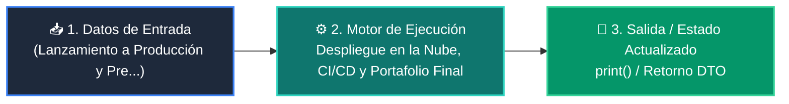

# 📘 Clase 08: Despliegue en la Nube, CI/CD y Portafolio Final

<div class="grid cards" markdown>

-   :material-bookmark: **Curso:** Curso 4: Taller Práctico & Proyecto Final Integrador (CLASE 08)
-   :material-signal-cellular-outline: **Nivel:** `Nivel 4 - Integrador`
-   :material-lightbulb-on: **Metáfora Central:** *«Lanzamiento a Producción y Presentación de tu Proyecto ante el Mundo»*
-   :material-file-pdf-box: **Manual PDF Oficial:** [Descargar clase-08-despliegue-cicd-portafolio.pdf](https://github.com/wisrovi/wisrovi-python/raw/main/04-proyecto-final/clase-08-despliegue-cicd-portafolio/clase-08-despliegue-cicd-portafolio.pdf)

</div>

<div align="center" style="margin: 1rem 0;" markdown>

[](https://colab.research.google.com/github/wisrovi/wisrovi-python/blob/main/04-proyecto-final/clase-08-despliegue-cicd-portafolio/notebook/clase-08-despliegue-cicd-portafolio.ipynb)
[](https://github.com/wisrovi/wisrovi-python/tree/main/04-proyecto-final/clase-08-despliegue-cicd-portafolio)

</div>

---

## 1. 💡 Fundamentación Teórica y Modelo Mental


!!! note "🌟 Modelo Mental de la Sesión: «Lanzamiento a Producción y Presentación de tu Proyecto ante el Mundo»"
    Es el corte de cinta inaugural de tu edificio de software: listo para recibir usuarios reales en todo el mundo.

### Principios Fundamentales de la Sesión


!!! info "⚡ Regla de Oro en Python"
    Un proyecto sin README ni tests no está terminado; la excelencia de ingeniería se demuestra en los detalles.

---

## 2. 🗺️ Arquitectura de Ejecución y Diagrama de Flujo



---

## 3. 💻 Código de Implementación Práctica

```python
class ChecklistGraduacion:
    def __init__(self, autor: str, proyecto: str):
        self.autor = autor
        self.proyecto = proyecto
        self.items = {
            "1. Codigo modular y PEP 8": True,
            "2. Suite de pruebas con Pytest": True,
            "3. Dockerfile y Docker Compose": True,
            "4. Documentacion README completa": True,
            "5. Video demo o capturas": True
        }

    def verificar(self) -> bool:
        return all(self.items.values())

grad = ChecklistGraduacion("Wisrovi Student", "AI Support Hub")
print(f"Estado de Graduación para {grad.autor}:")
for k, v in grad.items.items():
    print(f"  [{'X' if v else ' '}] {k}")
print(f"🏆 ¿Aprobado para Certificación?: {grad.verificar()}")
```

---

## 4. 🛡️ Buenas Prácticas, Gotchas y Prevención de Errores

!!! warning "⚠️ Trampa Frecuente (Gotcha)"
    Subir archivos temporales (__pycache__, .env, .venv) por no configurar un .gitignore limpio.

=== "❌ Antipatrón / Código Inadecuado"
    ```python
    # Repositorio con 100 archivos .pyc y credenciales secretas ❌
    ```

=== "✅ Patrón Recomendado / Pythonic"
    ```python
    # Repositorio con .gitignore estándar de Python y variables en secretos de GitHub ✅
    ```

!!! tip "🔧 Consejo de Ingeniería"
    

---

## 5. 🏋️ Desafío Práctico de la Clase

!!! example "🎯 Enunciado del Reto"
    **Abre tu Pull Request en '04-proyecto-final/proyectos-estudiantes/' para unirte al Cuadro de Honor.**

Para resolver este ejercicio en tu entorno:
1. Abre el archivo `ejercicios/reto.py` de esta clase en Visual Studio Code.
2. Implementa tu solución cumpliendo los requisitos y contratos de tipo.
3. Valida tus resultados ejecutando las pruebas unitarias:
   ```bash
   pytest tests/curso_04/test_clase_08_despliegue_cicd_portafolio.py
   ```

---

## 6. 📚 Fuentes y Bibliografía Recomendada

*   [📖 Documentación Oficial de Python 3](https://docs.python.org/3/)
*   [📑 Guía de Estilo Oficial PEP 8](https://peps.python.org/pep-0008/)
*   [📦 Ecosistema Open Source wisrovi en PyPI](https://pypi.org/user/wisrovi/)
