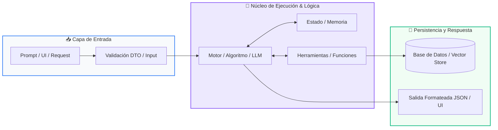

# Track 01: Aplicaciones Web con Python (FastAPI & Streamlit)

<div class="grid cards" markdown>

-   :material-school: __Nivel:__ Integrador / Producción
-   :material-book-open-page-variant: __Curso:__ Curso 4: Taller Práctico & Proyecto Final Personalizado
-   :material-lightbulb-on: __Metáfora:__ *«El Restaurante: La Carta (Frontend) y la Cocina de Alta Eficiencia (Backend)»*
-   :material-file-pdf-box: __Descargar PDF:__ [01-aplicacion-web.pdf](https://github.com/wisrovi/wisrovi-python/blob/main/04-proyecto-final/plantillas/01-aplicacion-web/01-aplicacion-web.pdf)

</div>

---

## 🎯 Objetivos de Aprendizaje

!!! abstract "Competencias Clave de la Sesión"
    *   **Competencia Conceptual:** Comprender la separación de responsabilidades Cliente-Servidor, APIs RESTful y el paradigma asíncrono async/await.
    *   **Competencia Práctica:** Construir y desplegar una aplicación web completa con endpoints RESTful, validación con Pydantic y dashboard interactivo.

---

## 1. 💡 Fundamentos Teóricos y Modelo Mental

Una aplicación web desacoplada divide la presentación visual del procesamiento central de datos mediante contratos de comunicación HTTP (APIs REST).

!!! note "🌟 Metáfora Central: El Restaurante: La Carta (Frontend) y la Cocina de Alta Eficiencia (Backend)"
    El frontend (Streamlit) es la carta elegante y el mozo que atiende al comensal en la mesa. El backend (FastAPI) es la cocina profesional donde los chefs procesan las comandas con máxima higiene, rapidez y orden, entregando los platos listos en formato JSON.

### Principios Fundamentales

FastAPI: Framework moderno, basado en Starlette y Pydantic, con soporte nativo de asincronía (ASGI) y tipado estático.

Verbos HTTP Semánticos: GET (consultar datos), POST (crear nuevos registros), PUT (actualizar), DELETE (eliminar).

!!! tip "⚡ Regla de Oro en Python"
    Nunca mezcles lógica pesada de base de datos en el cliente visual; el cliente solo consume y renderiza.

---

## 2. 🗺️ Diagrama de Arquitectura y Flujo de Control

Comunicación asíncrona mediante peticiones HTTP/JSON y validación cruzada.



### Desglose Paso a Paso del Flujo

| Fase del Flujo | Acción del Intérprete | Estado en Memoria |
| :--- | :--- | :--- |
| **1. Inicialización** | El usuario interactúa con widgets en Streamlit y presiona un botón. | `Evento en UI` |
| **2. Evaluación** | Streamlit envía una petición HTTP POST /api/v1/recurso con payload JSON. | `Request sobre HTTP` |
| **3. Transformación** | FastAPI valida los datos con Pydantic, ejecuta la lógica y persiste en DB. | `Validación & Persistencia` |
| **4. Retorno / Salida** | FastAPI responde HTTP 201 Created y Streamlit actualiza la vista reactivamente. | `UI actualizada` |

!!! info "🔍 Visualización Mental"
    FastAPI genera automáticamente documentación Swagger interactiva en la ruta /docs para probar todos tus endpoints.

---

## 3. 💻 Implementación Práctica en Python

Servicio web profesional con validación de modelos y control de estado HTTP:

```python title="main.py - Python 3.10+ (PEP 8)" linenums="1"
from fastapi import FastAPI, HTTPException, status
from pydantic import BaseModel

app = FastAPI(title="API de Gestión de Productos", version="1.0.0")

class ProductoDTO(BaseModel):
    nombre: str
    precio: float
    categoria: str

db_productos: list[dict] = []

@app.post("/productos", status_code=status.HTTP_201_CREATED)
async def crear_producto(prod: ProductoDTO):
    nuevo = {"id": len(db_productos) + 1, **prod.model_dump()}
    db_productos.append(nuevo)
    return {"mensaje": "Producto creado", "data": nuevo}

@app.get("/productos")
async def listar_productos():
    return {"total": len(db_productos), "productos": db_productos}
```

### Análisis Detallado del Código

Endpoints asíncronos decorados con FastAPI, validación automática mediante Pydantic DTO y códigos de estado HTTP semánticos.

---

## 4. 🛡️ Buenas Prácticas, Gotchas y Depuración

Vulnerabilidades y errores de arquitectura en APIs de producción:

!!! warning "⚠️ Gotcha Frecuente (Trampa de Principiante)"
    Olvidar configurar el middleware CORS (Cross-Origin Resource Sharing), bloqueando las peticiones del frontend.

### Comparativa: Patrón Recomendado vs Antipatrón

=== "✅ Patrón Pythonic Recomendado"
    ```python
from fastapi.middleware.cors import CORSMiddleware
app.add_middleware(CORSMiddleware, allow_origins=['*'])
    ```

=== "❌ Antipatrón / Mal Código"
    ```python
# Sin configuración CORS: Streamlit o React no podrán consumir la API
    ```

!!! success "🛡️ Consejo de Resiliencia en Producción"
    Utiliza uvicorn main:app --reload durante desarrollo y despliega con contenedores Docker en producción.

---

## 5. 🏋️ Ejercicios y Desafío de Autoestudio

!!! example "Desafío Práctico Recomendado"
    Integra autenticación JWT (JSON Web Tokens) en tu API de FastAPI para proteger endpoints sensibles.

???+ tip "🧪 Cómo validar tu solución con Pytest"
    Abre tu terminal en VS Code y ejecuta:
    ```bash
    pytest 04-proyecto-final/plantillas/01-aplicacion-web/ejercicios/
    ```

---

## 6. 📚 Fuentes y Referencias Oficiales

| Fuente / Recurso | Descripción Temática | Enlace Oficial |
| :--- | :--- | :--- |
| **Documentación Oficial de Python** | Referencia canónica del lenguaje y librería estándar | [docs.python.org/3/](https://docs.python.org/3/) |
| **PEP 8 — Style Guide for Python** | Guía oficial de estilo, formato e indentación | [peps.python.org/pep-0008/](https://peps.python.org/pep-0008/) |
| **Real Python Tutorials** | Artículos técnicos y patrones de desarrollo moderno | [realpython.com](https://realpython.com/) |
| **Suite Open Source wisrovi** | Paquetes Python para orquestación y rendimiento | [github.com/wisrovi](https://github.com/wisrovi) |
