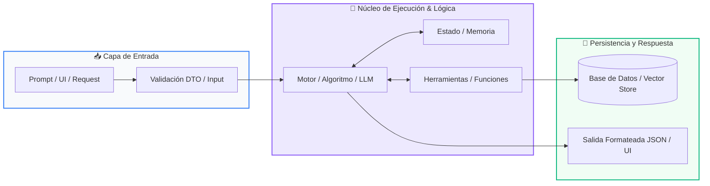

# Track 02: Chatbot Inteligente para Atención al Cliente

<div class="grid cards" markdown>

-   :material-school: __Nivel:__ Integrador / Producción
-   :material-book-open-page-variant: __Curso:__ Curso 4: Taller Práctico & Proyecto Final Personalizado
-   :material-lightbulb-on: __Metáfora:__ *«El Recepcionista Omnicanal y el Manual de Operaciones»*
-   :material-file-pdf-box: __Descargar PDF:__ [02-chatbot-inteligente.pdf](https://github.com/wisrovi/wisrovi-python/blob/main/04-proyecto-final/plantillas/02-chatbot-inteligente/02-chatbot-inteligente.pdf)

</div>

---

## 🎯 Objetivos de Aprendizaje

!!! abstract "Competencias Clave de la Sesión"
    *   **Competencia Conceptual:** Comprender la gestión del estado conversacional, el enrutamiento de intenciones y la prevención de alucinaciones corporativas.
    *   **Competencia Práctica:** Construir un bot conversacional con historial de diálogo, base de conocimiento RAG y despliegue en Telegram o Web.

---

## 1. 💡 Fundamentos Teóricos y Modelo Mental

Un chatbot empresarial no solo charla: responde preguntas frecuentes con precisión quirúrgica, consulta el estado de pedidos y transfiere a humanos cuando es necesario.

!!! note "🌟 Metáfora Central: El Recepcionista Omnicanal y el Manual de Operaciones"
    El chatbot es como el recepcionista estrella de una empresa: saluda cordialmente, recuerda todo lo que le dijiste en la conversación actual (memoria de sesión) y consulta de inmediato el manual de operaciones antes de dar una respuesta oficial.

### Principios Fundamentales

Gestión de Sesión: Cada usuario tiene un session_id único asociado a su buffer de historial en memoria (o en Redis).

Guardrails y System Prompt: Delimitan estrictamente las fronteras temáticas del bot para evitar que hable de temas ajenos a la empresa.

!!! tip "⚡ Regla de Oro en Python"
    Instruye siempre al chatbot en su System Prompt para que admita honestamente si no conoce una respuesta en lugar de inventar información.

---

## 2. 🗺️ Diagrama de Arquitectura y Flujo de Control

Ciclo de vida del mensaje desde la app de mensajería hasta la síntesis de respuesta.



### Desglose Paso a Paso del Flujo

| Fase del Flujo | Acción del Intérprete | Estado en Memoria |
| :--- | :--- | :--- |
| **1. Inicialización** | El usuario envía un mensaje en Telegram/WhatsApp; la plataforma emite un Webhook HTTP. | `Mensaje entrante` |
| **2. Evaluación** | El Session Manager recupera el historial previo del usuario desde la memoria caché. | `Historial de diálogo cargado` |
| **3. Transformación** | Se inyecta el contexto RAG de la empresa y el LLM formula la respuesta corporativa. | `Inferencia contextualizada` |
| **4. Retorno / Salida** | Se guarda el nuevo turno en el historial y se envía el mensaje al canal del usuario. | `Respuesta entregada al chat` |

!!! info "🔍 Visualización Mental"
    Mantén los prompts del sistema concisos y enfócate en el tono de voz (amable, formal, conciso).

---

## 3. 💻 Implementación Práctica en Python

Gestor de memoria de diálogo multi-usuario en Python:

```python title="main.py - Python 3.10+ (PEP 8)" linenums="1"
class ChatbotAtencionCliente:
    def __init__(self, nombre_empresa: str):
        self.nombre_empresa = nombre_empresa
        self.sesiones: dict[str, list] = {}
        self.system_prompt = f"Eres el asistente virtual de {nombre_empresa}. Sé conciso y formal."

    def responder_usuario(self, user_id: str, mensaje: str) -> str:
        if user_id not in self.sesiones:
            self.sesiones[user_id] = [{"role": "system", "content": self.system_prompt}]
        
        # Agregar turno del usuario
        self.sesiones[user_id].append({"role": "user", "content": mensaje})
        
        # Simulación de respuesta del LLM contextualizada
        respuesta = f"Hola, gracias por contactar a {self.nombre_empresa}. ¿En qué puedo ayudarte?"
        self.sesiones[user_id].append({"role": "assistant", "content": respuesta})
        
        return respuesta
```

### Análisis Detallado del Código

Clase que gestiona sesiones independientes por usuario, acumulando el historial en el formato canónico de roles de los LLMs.

---

## 4. 🛡️ Buenas Prácticas, Gotchas y Depuración

Errores comunes en sistemas conversacionales:

!!! warning "⚠️ Gotcha Frecuente (Trampa de Principiante)"
    No limitar el tamaño del historial acumulado; con el tiempo la conversación agota la ventana de contexto y eleva los costes innecesariamente.

### Comparativa: Patrón Recomendado vs Antipatrón

=== "✅ Patrón Pythonic Recomendado"
    ```python
# Mantener solo los últimos K mensajes (Sliding Window Memory)
    ```

=== "❌ Antipatrón / Mal Código"
    ```python
# Acumular cientos de mensajes sin podar el historial
    ```

!!! success "🛡️ Consejo de Resiliencia en Producción"
    Usa una ventana deslizante (ej: últimos 10 mensajes) o resume periódicamente los turnos anteriores.

---

## 5. 🏋️ Ejercicios y Desafío de Autoestudio

!!! example "Desafío Práctico Recomendado"
    Integra la biblioteca python-telegram-bot para publicar tu chatbot en vivo en un canal de Telegram.

???+ tip "🧪 Cómo validar tu solución con Pytest"
    Abre tu terminal en VS Code y ejecuta:
    ```bash
    pytest 04-proyecto-final/plantillas/02-chatbot-inteligente/ejercicios/
    ```

---

## 6. 📚 Fuentes y Referencias Oficiales

| Fuente / Recurso | Descripción Temática | Enlace Oficial |
| :--- | :--- | :--- |
| **Documentación Oficial de Python** | Referencia canónica del lenguaje y librería estándar | [docs.python.org/3/](https://docs.python.org/3/) |
| **PEP 8 — Style Guide for Python** | Guía oficial de estilo, formato e indentación | [peps.python.org/pep-0008/](https://peps.python.org/pep-0008/) |
| **Real Python Tutorials** | Artículos técnicos y patrones de desarrollo moderno | [realpython.com](https://realpython.com/) |
| **Suite Open Source wisrovi** | Paquetes Python para orquestación y rendimiento | [github.com/wisrovi](https://github.com/wisrovi) |
