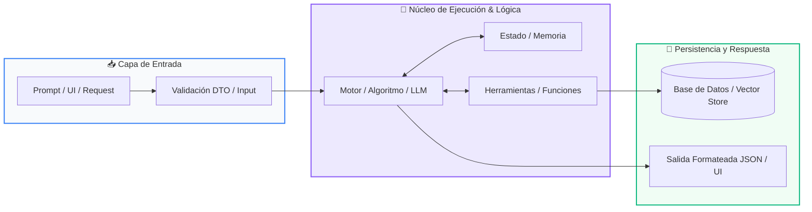

# Track 03: Sistema de Gestión con Base de Datos Relacional

<div class="grid cards" markdown>

-   :material-school: __Nivel:__ Integrador / Producción
-   :material-book-open-page-variant: __Curso:__ Curso 4: Taller Práctico & Proyecto Final Personalizado
-   :material-lightbulb-on: __Metáfora:__ *«El Archivo Notarial y la Bóveda de Datos ACID»*
-   :material-file-pdf-box: __Descargar PDF:__ [03-sistema-gestion-bd.pdf](https://github.com/wisrovi/wisrovi-python/blob/main/04-proyecto-final/plantillas/03-sistema-gestion-bd/03-sistema-gestion-bd.pdf)

</div>

---

## 🎯 Objetivos de Aprendizaje

!!! abstract "Competencias Clave de la Sesión"
    *   **Competencia Conceptual:** Comprender el modelo relacional de datos, las claves primarias/foráneas y la integridad transaccional ACID.
    *   **Competencia Práctica:** Construir un sistema de persistencia completo con repositorios en Python puro interactuando con SQLite / PostgreSQL.

---

## 1. 💡 Fundamentos Teóricos y Modelo Mental

La memoria RAM se borra al apagar la computadora; una base de datos relacional garantiza que la información de tus clientes y finanzas persista para siempre de forma atómica e íntegra.

!!! note "🌟 Metáfora Central: El Archivo Notarial y la Bóveda de Datos ACID"
    Una base de datos relacional es como una bóveda notarial de alta seguridad: cada tabla es un libro de registros con columnas estrictas, y cada transacción es un contrato firmado. O se realizan todos los pasos de la operación o se cancela por completo sin dejar inconsistencias a medias.

### Principios Fundamentales

Propiedades ACID: Atomicidad (todo o nada), Consistencia (cumple reglas), Aislamiento (concurrencia segura), Durabilidad (persiste en disco).

Inyección SQL: La vulnerabilidad #1 en bases de datos; ocurre al concatenar texto crudo en queries. Se previene siempre con consultas parametrizadas (?) o (%s).

!!! tip "⚡ Regla de Oro en Python"
    NUNCA uses f-strings para construir sentencias SQL (ej: f'SELECT * FROM u WHERE id={id}'); usa siempre queries parametrizadas con tuplas.

---

## 2. 🗺️ Diagrama de Arquitectura y Flujo de Control

Arquitectura en capas (Layered Architecture) para aislar las sentencias SQL de la lógica de negocio.



### Desglose Paso a Paso del Flujo

| Fase del Flujo | Acción del Intérprete | Estado en Memoria |
| :--- | :--- | :--- |
| **1. Inicialización** | La capa de negocio solicita guardar o consultar una entidad. | `Llamada a método del Repositorio` |
| **2. Evaluación** | El Repositorio abre una conexión/cursor y prepara la sentencia parametrizada. | `Preparación de la query` |
| **3. Transformación** | El motor de base de datos ejecuta la transacción y valida claves únicas. | `Ejecución ACID en disco` |
| **4. Retorno / Salida** | Se realiza commit() para asegurar los cambios y se cierra la conexión de forma segura. | `Datos persistidos permanentemente` |

!!! info "🔍 Visualización Mental"
    Utiliza siempre context managers (with sqlite3.connect(...) as conn:) para asegurar el cierre de conexiones.

---

## 3. 💻 Implementación Práctica en Python

Implementación de persistencia relacional con transacciones y consultas parametrizadas:

```python title="main.py - Python 3.10+ (PEP 8)" linenums="1"
import sqlite3

class RepositorioUsuarios:
    def __init__(self, db_path: str = "app.db"):
        self.db_path = db_path
        self._crear_tabla()

    def _crear_tabla(self) -> None:
        with sqlite3.connect(self.db_path) as conn:
            cursor = conn.cursor()
            cursor.execute('''
                CREATE TABLE IF NOT EXISTS usuarios (
                    id INTEGER PRIMARY KEY AUTOINCREMENT,
                    nombre TEXT NOT NULL,
                    email TEXT UNIQUE NOT NULL,
                    saldo REAL DEFAULT 0.0
                )
            ''')
            conn.commit()

    def insertar_usuario(self, nombre: str, email: str, saldo: float) -> int:
        with sqlite3.connect(self.db_path) as conn:
            cursor = conn.cursor()
            # Consulta parametrizada segura contra Inyección SQL
            cursor.execute(
                "INSERT INTO usuarios (nombre, email, saldo) VALUES (?, ?, ?)",
                (nombre, email, saldo)
            )
            conn.commit()
            return cursor.lastrowid
```

### Análisis Detallado del Código

Clase Repository que encapsula la lógica SQL, maneja el ciclo de vida de conexiones y previene vulnerabilidades de inyección SQL.

---

## 4. 🛡️ Buenas Prácticas, Gotchas y Depuración

Errores críticos que provocan pérdida de datos o brechas de seguridad:

!!! warning "⚠️ Gotcha Frecuente (Trampa de Principiante)"
    Concatenar variables de usuario directamente dentro de sentencias SQL, permitiendo ataques de Inyección SQL.

### Comparativa: Patrón Recomendado vs Antipatrón

=== "✅ Patrón Pythonic Recomendado"
    ```python
cursor.execute("SELECT * FROM users WHERE user = ?", (user,)) # Inmune a inyección
    ```

=== "❌ Antipatrón / Mal Código"
    ```python
cursor.execute(f"SELECT * FROM users WHERE user = '{user}'") # ¡Vulnerable!
    ```

!!! success "🛡️ Consejo de Resiliencia en Producción"
    Crea siempre índices (CREATE INDEX) sobre las columnas que uses frecuentemente en cláusulas WHERE o JOIN.

---

## 5. 🏋️ Ejercicios y Desafío de Autoestudio

!!! example "Desafío Práctico Recomendado"
    Implementa una transacción bancaria que transfiera saldo entre dos usuarios asegurando atomicidad con rollback en caso de error.

???+ tip "🧪 Cómo validar tu solución con Pytest"
    Abre tu terminal en VS Code y ejecuta:
    ```bash
    pytest 04-proyecto-final/plantillas/03-sistema-gestion-bd/ejercicios/
    ```

---

## 6. 📚 Fuentes y Referencias Oficiales

| Fuente / Recurso | Descripción Temática | Enlace Oficial |
| :--- | :--- | :--- |
| **Documentación Oficial de Python** | Referencia canónica del lenguaje y librería estándar | [docs.python.org/3/](https://docs.python.org/3/) |
| **PEP 8 — Style Guide for Python** | Guía oficial de estilo, formato e indentación | [peps.python.org/pep-0008/](https://peps.python.org/pep-0008/) |
| **Real Python Tutorials** | Artículos técnicos y patrones de desarrollo moderno | [realpython.com](https://realpython.com/) |
| **Suite Open Source wisrovi** | Paquetes Python para orquestación y rendimiento | [github.com/wisrovi](https://github.com/wisrovi) |
