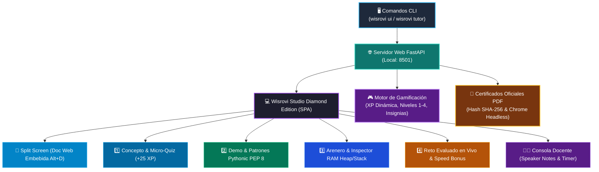

# 🖥️ Ecosistema Interactivo & Tutor Virtual (`wisrovi_lib`)

El ecosistema de **`wisrovi-python`** incluye una plataforma integral de aprendizaje activo con interfaz gráfica local, motor de tutoría socrática con IA, inspector de memoria RAM Heap/Stack en tiempo real, gamificación RPG y generación de diplomas oficiales en PDF.

---

## 🗺️ Arquitectura del Ecosistema

---

## 📑 Secciones del Ecosistema

| Documento | Descripción |
| :--- | :--- |
| [🎓 Tutor Virtual & Wisrovi Studio](tutor-virtual.md) | Diferencias entre `wisrovi ui` y `wisrovi tutor`, modo proyector, split view web y flujo de 4 pasos. |
| [🎮 Gamificación, XP y Progresión](gamificacion.md) | Sistema de XP dinámico por velocidad, niveles 1 a 4, insignias, bloqueo secuencial y modo repaso. |
| [📜 Certificación Oficial en PDF](certificados.md) | Emisión de diplomas apaisados de 160 horas con verificación criptográfica SHA-256. |
