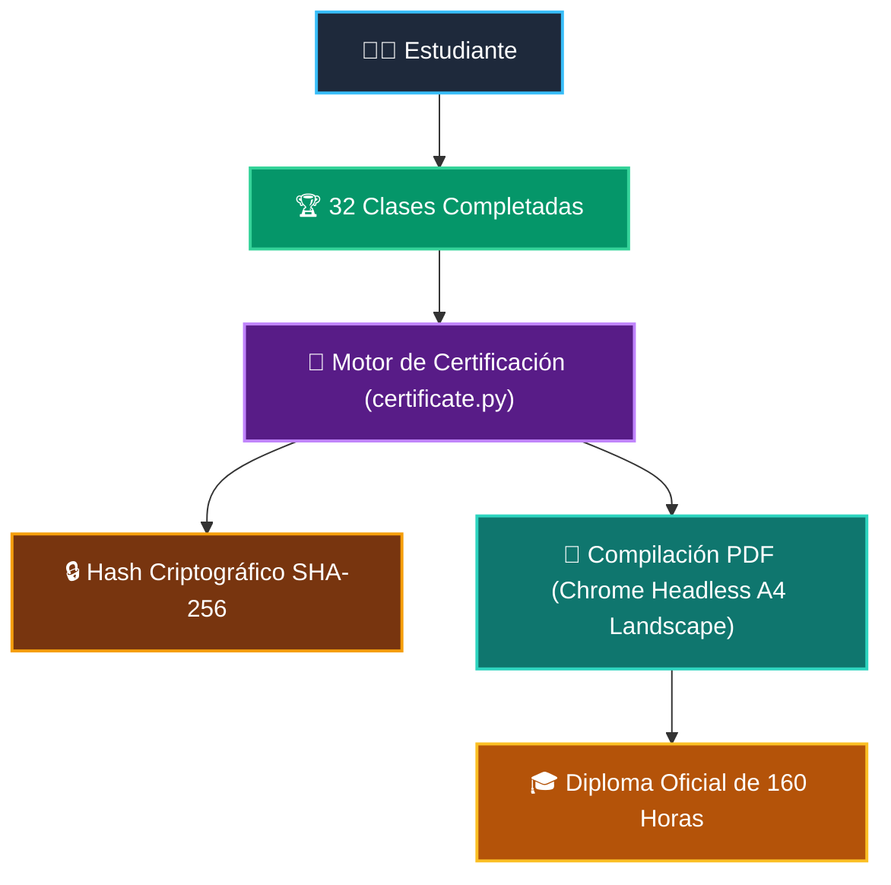

# 📜 Certificación Oficial y Diplomas Verificables

Al completar los cursos del programa formativo, los estudiantes obtienen diplomas oficiales de graduación con validez técnica y respaldo de **Wisrovi Academy**.

---

## 🏛️ Características del Diploma Oficial



- **Acreditación Horaria:** Diploma maestro de **160 horas de ingeniería práctica** o diplomas modulares por curso (40 horas cada uno).
- **Verificación Criptográfica:** Cada diploma incluye un identificador único generado mediante hash SHA-256 basado en el nombre del estudiante, el título del curso y la fecha de expedición.
- **Compilación de Alta Calidad:** Generado directamente en formato PDF apaisado (*Landscape*) con tipografía institucional, sellos dorados y estética LaTeX.
- **Badge Markdown para LinkedIn y GitHub:** Insignia interactiva lista para insertar en el perfil o README del alumno:
  ```markdown
  [](https://academy_python.wisrovi.dev)
  ```

---

## 🚀 Emisión del Certificado

### Vía Interfaz Web (`wisrovi ui`)
1. Pulsa en el botón **`📜 Certificado`** en la barra superior.
2. Ingresa tu nombre completo.
3. Selecciona el curso o el **Programa Integral de 160 Horas**.
4. Haz clic en **`Descargar Certificado (PDF Oficial)`**.

### Vía Línea de Comandos (CLI)
```bash
wisrovi certificate --name "Alejandro Martínez" --output "mi_certificado.pdf"
```
