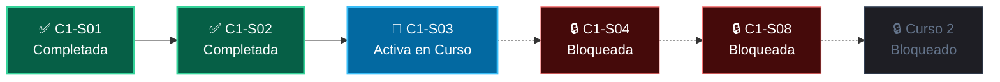

# 🎮 Gamificación, XP y Progresión Secuencial

El sistema de gamificación de **`wisrovi-python`** transforma el aprendizaje de programación en una experiencia RPG progresiva, asegurando que el estudiante adquiera destreza mediante práctica deliberada y continua.

---

## ⚡ Sistema de Experiencia (XP) Dinámico por Velocidad

La resolución de retos evalúa el tiempo transcurrido desde que se inicia la lección hasta que se supera la suite de pruebas automatizadas:

| Ritmo de Aprendizaje | Tiempo Transcurrido | Bonificación de XP | Total XP Otorgado |
| :--- | :--- | :--- | :--- |
| **⚡ Rápido (Speedster)** | Menos de 5 minutos (< 300s) | **+50 XP Bonus** | **200 XP** (+ Insignia `speedster`) |
| **🎯 Óptimo (Focus)** | Entre 5 y 15 minutos (300s - 900s) | **+25 XP Bonus** | **175 XP** |
| **⏳ Estándar** | Entre 15 y 30 minutos (900s - 1800s) | **0 XP (Base)** | **150 XP** |
| **🐢 Exploración Lenta** | Más de 30 minutos (> 1800s) | **-30 XP Ajuste** | **120 XP** |

Adicionalmente:
- **Micro-Quizzes Conceptuales (Paso 1):** Otorgan **+25 XP** por respuesta correcta.
- **Insignias Desbloqueadas:** Otorgan **+100 XP** adicionales.

---

## 🛡️ Regla de Progresión Secuencial Lineal (*Anti-Skip Gate*)

El estudiante **no puede adelantar lecciones** sin haber superado previamente las anteriores en estricto orden pedagógico:

### Reglas de Acceso:
1. **Clase C1-S01:** Siempre abierta para iniciar el aprendizaje.
2. **Clase Siguiente:** Se desbloquea únicamente al superar el reto del Paso 4 de la clase inmediatamente anterior.
3. **Cursos Posteriores (C2, C3, C4):** Se desbloquean al completar la totalidad de las 8 clases del curso previo.

---

## 🔄 Modo Repaso y Práctica Libre Permanente

Toda lección que el estudiante haya superado previamente queda **permanentemente desbloqueada** con el estado `✓ Repasar`. 

- Al ingresar a una lección superada, se activa el distintivo:  
  `🔄 Modo Repaso y Práctica Libre (Clase ya superada)`
- El estudiante puede re-ejecutar el código, experimentar en el arenero de memoria RAM y re-evaluar los retos tantas veces como desee sin perder su progreso ni alterar la progresión de las clases avanzadas.

---

## 🏆 Niveles de Maestría

| Nivel | Rango de XP | Título de Maestría | Icono |
| :---: | :---: | :--- | :---: |
| **1** | 0 - 499 XP | 🌱 Aprendiz de Python | 🌱 |
| **2** | 500 - 1,499 XP | ⚡ Explorador de Algoritmos | ⚡ |
| **3** | 1,500 - 2,999 XP | 🤖 Arquitecto de Agentes de IA | 🤖 |
| **4** | 3,000+ XP | 🏆 Master Engineer Full-Stack | 🏆 |

---

## 🎖️ Insignias Oficiales del Alumno

- 🚴 **Primer Pedaleo (`first_code`):** Ejecutar la primera línea de código interactiva.
- 🔬 **Explorador del Heap (`memory_master`):** Inspeccionar variables en el visualizador de memoria RAM.
- ✨ **Código Pythonic (`speedster`):** Superar un reto en menos de 5 minutos.
- 🔥 **Racha Imparable (`streak_3`):** Estudiar 3 días consecutivos.
- 🎯 **Fundador de Python (`c1_graduate`):** Completar las 8 clases del Curso 1.
- ⚡ **Mago de Algoritmos (`c2_graduate`):** Completar las 8 clases del Curso 2.
- 🤖 **Conjurador de IA (`c3_graduate`):** Completar las 8 clases del Curso 3.
- 🏆 **Graduado de Élite (`c4_graduate`):** Completar las 32 clases del programa integral.
