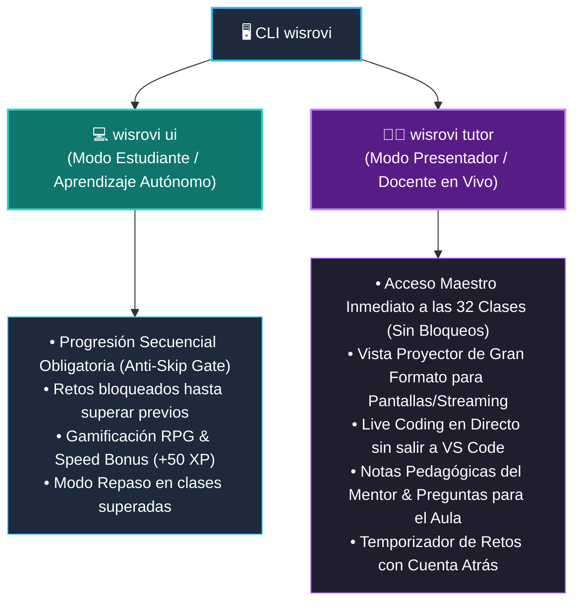
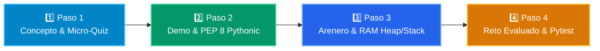

# 🎓 Tutor Virtual & Wisrovi Studio

**Wisrovi Studio** es el entorno de aprendizaje interactivo local que acompaña al estudiante a lo largo de las 32 semanas del programa de formación.

---

## ❓ ¿Qué diferencias hay entre `wisrovi ui` y `wisrovi tutor`?

Ambos comandos forman parte del ecosistema de **`wisrovi-python`**, pero están diseñados para dos roles y propósitos claramente diferenciados:

| Dimensión | `wisrovi ui` (Modo Estudiante) | `wisrovi tutor` (Modo Presentador / Docente) |
| :--- | :--- | :--- |
| **Público Objetivo** | **Estudiante / Alumno** que aprende a su propio ritmo. | **Profesor, Mentor o Ponente** impartiendo una clase en directo. |
| **Acceso a Clases** | **Progresión Secuencial:** No se puede adelantar sin superar la lección anterior. | **Acceso Maestro Desbloqueado:** Salto instantáneo a cualquiera de las 32 clases. |
| **Herramientas Clave** | Stepper de 4 pasos, Micro-Quizzes con XP, Arenero RAM, Reto evaluado y Certificados. | Live Coding ante la audiencia, Notas del Mentor con guión socrático, Temporizador de retos. |
| **Modo Proyector** | Tipografía estándar de estudio individual. | **Modo Proyector de Gran Formato (📺):** Alta visibilidad para Zoom, Meet y proyectores. |
| **Comando CLI** | `wisrovi ui` (o `wisrovi ui -c 2 -s 3`) | `wisrovi tutor` (o `wisrovi tutor -c 3 -s 1`) |

---

## 🌐 Integración Híbrida: GitHub Pages + Studio Local

La plataforma web documental ([`academy_python.wisrovi.dev`](https://academy_python.wisrovi.dev)) y el estudio local (`wisrovi ui`) funcionan en perfecta sintonía:

1. **Lectura Online Gratuita y Universal:** Puedes repasar toda la teoría, diagramas Mermaid y buenas prácticas en la web desde cualquier dispositivo móvil o de escritorio.
2. **Resolución en 1 Clic (Deep Linking):** En cada página de clase de la documentación web, encontrarás botones interactivos:
   * **`🚀 Abrir en Wisrovi Studio (Local)`**: Abre la interfaz local en `http://127.0.0.1:8501/?course=X&class=Y` posicionada directamente en el reto.
   * **`👨‍🏫 Presentar en Modo Tutor`**: Abre la consola del docente en `http://127.0.0.1:8501/tutor?course=X&class=Y` con las notas del mentor cargadas.
3. **Privacidad y Cero Latencia:** El código se ejecuta íntegramente en tu CPU local sin enviar datos a servidores externos.

---

## 🔄 El Flujo Obligatorio de 4 Pasos (Stepper Gates)

Para asegurar la asimilación profunda de cada concepto según **La Regla de la Bicicleta**, cada una de las 32 clases está estructurada en 4 compuertas pedagógicas obligatorias:

### 1️⃣ Paso 1: Concepto Central & Micro-Quiz (+25 XP)
- Fundamentación teórica anclada en la metáfora del mundo real (*El Megáfono*, *Las Cajas*, *El Semáforo*, etc.).
- Diagrama de arquitectura Mermaid renderizado de forma nativa.
- **Micro-Quiz Interactivo:** Preguntas de opción múltiple con retroalimentación instantánea que premian con **+25 XP** las respuestas acertadas.

### 2️⃣ Paso 2: Demostración & Patrones Pythonic PEP 8
- Código ejecutable en vivo con medición del tiempo de compilación en milisegundos (`⚡ ms`).
- **Comparador Lado a Lado:** Bloque diferencial que compara malas prácticas o código estilo C frente al patrón limpio canónico de Python.

### 3️⃣ Paso 3: Arenero & Inspector de Memoria RAM 3.0
- Laboratorio libre para experimentar con variables, mutabilidad y tipos de datos.
- **Visualizador Heap vs Stack:** Inspección de direcciones hexadecimales de memoria (`id(obj)`), tamaño exacto en bytes (`sys.getsizeof`) y etiquetas de mutabilidad.
- Botón **`✨ Formatear (PEP 8)`** para estandarizar el código mediante el AST de Python.

### 4️⃣ Paso 4: Reto Práctico Evaluado en Vivo
- Especificación formal del reto con contratos de tipado y condiciones límite.
- Ejecución automática de pruebas unitarias con Pytest en el backend.
- Sistema de **Pistas Socráticas Progresivas** que orientan sin revelar la solución directamente.

---

## ⌨️ Atajos de Teclado del Wisrovi Studio

| Atajo | Acción |
| :--- | :--- |
| <kbd>Ctrl</kbd> + <kbd>Enter</kbd> | Ejecutar código en el paso activo (Demo, Arenero o Evaluación del Reto). |
| <kbd>Ctrl</kbd> + <kbd>K</kbd> | Abrir la Paleta de Comandos rápida para buscar clases y acciones. |
| <kbd>Ctrl</kbd> + <kbd>B</kbd> | Colapsar o expandir la barra lateral del currículo. |
| <kbd>Alt</kbd> + <kbd>1..4</kbd> | Conmutar directamente entre los Pasos 1, 2, 3 y 4. |
| <kbd>Esc</kbd> | Cerrar cualquier ventana modal activa (Certificado, Atajos, Perfil). |
