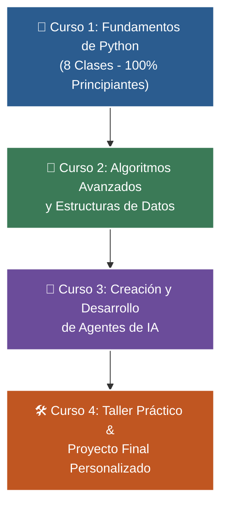

# 🐍 Programa Integral de Formación en Python
### *De Cero a Agentes de Inteligencia Artificial*

-   :material-school: __Nivel:__ Principiante a Avanzado
-   :material-account-tie: __Instructor:__ [William Rodríguez (Wisrovi)](https://wisrovi.dev)
-   :material-code-tags: __Tecnologías:__ Python 3.10+, FastAPI, Streamlit, Pydantic, RAG, ReAct Agents
-   :material-license: __Licencia:__ Código Abierto (MIT)

Bienvenido/a a la plataforma web interactiva del **Programa de Formación en Python**. Esta academia online está diseñada para guiarte paso a paso desde que escribes tu primera línea de código hasta el desarrollo y despliegue de **Agentes de Inteligencia Artificial Autónomos** y aplicaciones web de producción.

---

## 🚀 La Ruta de Aprendizaje (4 Niveles Secuenciales)

---

## 📚 Explorador de Cursos

=== "🎯 Curso 1: Fundamentos (8 Clases)"
    *   **Público objetivo:** 100% Principiantes que nunca han programado.
    *   **Contenidos:** Variables, Tipos de Datos, Condicionales (`if`/`else`), Bucles (`for`/`while`), Listas, Diccionarios, Funciones (`def`) y Proyecto CLI.
    *   [👉 Ir al Curso 1](curso-01/book.md)

=== "🚀 Curso 2: Algoritmos y Estructuras"
    *   **Público objetivo:** Nivel Intermedio enfocado en optimización y entrevistas técnicas.
    *   **Contenidos:** Pilas (LIFO), Colas (FIFO), Sets, Análisis Big-O ($\mathcal{O}(n)$), Búsqueda Binaria, QuickSort y Programación Dinámica con Memoización (`@lru_cache`).
    *   [👉 Ir al Curso 2](curso-02/book.md)

=== "🤖 Curso 3: Agentes de Inteligencia Artificial"
    *   **Público objetivo:** Nivel Avanzado para ingenieros de IA.
    *   **Contenidos:** Modelos LLM, Validación Tipada con Pydantic, Tool Calling / Function Calling, Memoria Vectorial y RAG, y Arquitectura de Agentes ReAct.
    *   [👉 Ir al Curso 3](curso-03/book.md)

=== "🛠️ Curso 4: Taller Práctico y Proyecto Final"
    *   **Público objetivo:** Integración profesional y portafolio.
    *   **Contenidos:** Aplicación Web Full-Stack (FastAPI + Streamlit), Chatbot Inteligente con Memoria y Sistema Transaccional con Base de Datos SQL.
    *   [👉 Ir al Curso 4](curso-04/book.md)

---

## 👤 Acerca del Instructor y Mentor

<h3>William Rodríguez (Wisrovi)</h3>

<strong>AI Solutions Architect & Principal Software Engineer</strong> &bull; Badajoz, España

Ingeniero y arquitecto de software especializado en Inteligencia Artificial Generativa, sistemas multi-agente, Visión por Computador e infraestructuras MLOps de alta disponibilidad. Creador y mantenedor de la suite de software libre <strong>wisrovi SUITE</strong> en PyPI con más de 26 bibliotecas enfocadas en orquestación de pipelines, caching distribuido y optimización de bases de datos.

*   🐙 **GitHub:** [github.com/wisrovi](https://github.com/wisrovi)
*   💼 **LinkedIn:** [linkedin.com/in/wisrovi-rodriguez](https://www.linkedin.com/in/wisrovi-rodriguez/)
*   🐳 **DockerHub:** [hub.docker.com/u/wisrovi](https://hub.docker.com/u/wisrovi)
*   🌐 **Website:** [wisrovi.dev](https://wisrovi.dev)

---

## 🚲 Filosofía de Estudio: La Regla de la Bicicleta

!!! quote "La Regla de Oro"
    *"Por más libros que leas o explicaciones que escuches sobre cómo guardar el equilibrio, si no te subes a la bicicleta y pedaleas por ti mismo, nunca vas a aprender a andar en bici."*

Aprender a programar es una habilidad 100% práctica. Esta plataforma incluye código fuente ejecutable, cuadernos de Google Colab y pruebas automatizadas con `pytest` para cada lección. ¡Abre tu editor, escribe el código y experimenta! 🚴‍♂️
