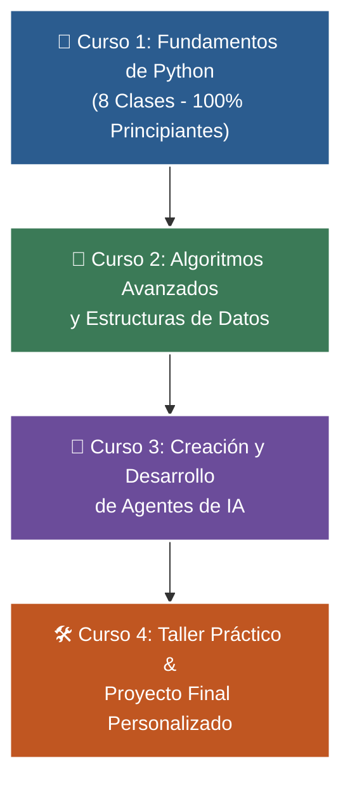

# 🐍 Programa Integral de Formación en Python

Bienvenido/a al portal web oficial del **Programa Integral de Formación en Python: De Cero a Agentes de IA**.

---

## 🎯 Mapa de Aprendizaje (4 Niveles)

---

## 📚 Acceso Directo a los Manuales

| Curso | Nivel | Contenidos Clave | Enlace al Manual |
| :---: | :--- | :--- | :---: |
| **Curso 1** | **Fundamentos Básicos** | 8 Clases: variables, if, for, def, colecciones y proyecto CLI | [📘 Ver Curso 1](curso-01/book.md) |
| **Curso 2** | **Algoritmos y Estructuras** | Pilas, colas, sets, Big-O, búsqueda binaria y recursión | [📘 Ver Curso 2](curso-02/book.md) |
| **Curso 3** | **Agentes de IA** | LLMs, Tool Calling, memoria vectorial, RAG y ciclo ReAct | [📘 Ver Curso 3](curso-03/book.md) |
| **Curso 4** | **Proyecto Integrador** | FastAPI + Streamlit, Chatbots con memoria y bases de datos | [📘 Ver Curso 4](curso-04/book.md) |

---

## 👤 Acerca del Instructor

**William Rodríguez (Wisrovi)**  
*AI Solutions Architect & Principal Software Engineer &bull; Badajoz, España*

* 🐙 **GitHub:** [github.com/wisrovi](https://github.com/wisrovi)
* 💼 **LinkedIn:** [linkedin.com/in/wisrovi-rodriguez](https://www.linkedin.com/in/wisrovi-rodriguez/)
* 🐳 **DockerHub:** [hub.docker.com/u/wisrovi](https://hub.docker.com/u/wisrovi)
* 🌐 **Website:** [wisrovi.dev](https://wisrovi.dev)

> *"La regla de la bicicleta: Nadie aprende a montar en bicicleta viendo tutoriales. El verdadero dominio de la programación surge cuando abres tu editor, escribes código con tus propias manos, resuelves errores y construyes proyectos reales."* 🚴‍♂️
