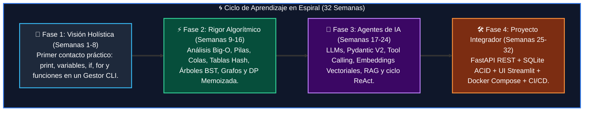

# 🐍 Academia de Python: De Cero a Agentes de IA

<div class="grid cards" markdown>

-   :material-school: __Programa Completo:__ 4 Cursos &bull; 32 Semanas Formativas
-   :material-account-tie: __Director Académico:__ [William Rodríguez (Wisrovi)](https://wisrovi.dev)
-   :material-code-tags: __Stack de Ingeniería:__ Python 3.10+, FastAPI, Streamlit, Pydantic V2, RAG, ReAct Agents, Docker
-   :material-license: __Licencia:__ Código Abierto (MIT)

</div>

<div align="center" style="margin: 1.5rem 0;" markdown>

[](https://codespaces.new/wisrovi/wisrovi-python)
[](https://github.com/wisrovi/wisrovi-python)
[](https://pypi.org/user/wisrovi/)
[](https://github.com/wisrovi/wisrovi-python)

</div>

Bienvenido/a al portal oficial del **Programa Integral de Formación en Python**. Esta plataforma reúne todo el material interactivo, manuales técnicos descargables en PDF, libros digitales, cuadernos ejecutables en Google Colab y el **Tutor Virtual Socrático** para formarte desde los fundamentos de la programación hasta el despliegue de **Agentes de Inteligencia Artificial**.

---

## 🖥️ Ecosistema Interactivo: Wisrovi Studio & Modo Presentador Docente

La librería **`wisrovi-python`** incluye un entorno de aprendizaje y presentación local con interfaz gráfica en navegador:

<div class="grid cards" markdown>

-   **🎓 [Wisrovi Studio (`wisrovi ui`)](ecosistema/tutor-virtual.md)**  
    Estudio interactivo para el estudiante con progresión secuencial lineal, 4 pasos obligatorios (*Concepto & Quiz*, *Demo PEP 8*, *Arenero & RAM 3.0*, *Reto Evaluado*) y Documentación Web Embebida en Pantalla Dividida (Split Screen).

-   **👨‍🏫 [Consola Docente (`wisrovi tutor`)](ecosistema/tutor-virtual.md)**  
    Modo presentación en vivo con acceso maestro a las 32 clases, vista para proyector/streaming, Live Coding interactivo, Speaker Notes y Temporizador de Aula.

-   **🎮 [Gamificación RPG & Speed Bonus](ecosistema/gamificacion.md)**  
    Niveles 1-4, insignias de maestría, bonificaciones dinámicas por velocidad de resolución y bloqueo secuencial anti-saltos.

-   **📜 [Certificados Oficiales PDF](ecosistema/certificados.md)**  
    Diplomas profesionales de 160 horas con verificación criptográfica SHA-256 compilados vía Chrome Headless.

</div>

```bash
# Lanzar el Estudio Interactivo para Estudiantes (Modo Autónomo)
wisrovi ui

# Lanzar la Consola del Docente / Modo Presentación (Master Access)
wisrovi tutor
```

---

## 👤 Dirección Académica y Mentoría

<div class="grid cards" markdown>

-   **William Rodríguez (Wisrovi)**  
    *AI Solutions Architect & Principal Software Engineer &bull; Badajoz, España*  
    Ingeniero de software y arquitecto de sistemas de Inteligencia Artificial Generativa. Creador y mantenedor de **wisrovi SUITE** en PyPI con más de 26 paquetes publicados de optimización, bases de datos y orquestación.
    
    [:octicons-mark-github-16: GitHub](https://github.com/wisrovi) &bull; [:octicons-globe-16: Sitio Web](https://wisrovi.dev) &bull; [:octicons-package-16: PyPI](https://pypi.org/user/wisrovi/) &bull; [:octicons-link-external-16: LinkedIn](https://www.linkedin.com/in/wisrovi-rodriguez/)

</div>

---

## 🌀 Metodología Pedagógica: Aprendizaje en Espiral

Nuestra metodología se basa en el **Aprendizaje en Espiral *(Spiral Learning)***: el estudiante nunca memoriza conceptos aislados, sino que los experimenta en ciclos continuos de complejidad creciente:



!!! tip "🚲 La Regla de la Bicicleta (Pedaleo Activo)"
    Nadie aprende a programar leyendo código ajeno de forma pasiva. El aprendizaje real se consolida cuando abres tu editor, escribes el código por ti mismo, interpretas los mensajes de error de Python y superas los retos con las pruebas de Pytest.

---

## 📚 Mapa General de los 4 Cursos

=== "🎯 Curso 1: Fundamentos (8 Semanas)"
    *   **Nivel:** 100% Principiantes &bull; **Clases:** 8 &bull; **Ejemplos:** 33
    *   **Temario:** Primer vistazo práctico, variables y tipos de datos en memoria, condicionales `if/else`, bucles `for/while`, colecciones mutables, diccionarios O(1), funciones modulares y proyecto CLI.
    *   [📘 Ver Manual Completo del Curso 1](curso-01/book.md) &bull; [🚀 Explorar Clase 01](curso-01/clase-01.md)

=== "⚡ Curso 2: Algoritmos y Estructuras (8 Semanas)"
    *   **Nivel:** Intermedio &bull; **Clases:** 8 &bull; **Ejemplos:** 32
    *   **Temario:** Notación Big-O, pilas y colas con `deque`, tablas hash, búsqueda binaria, QuickSort, árboles BST, grafos BFS/DFS y memoización dinámica con `@lru_cache`.
    *   [📘 Ver Manual Completo del Curso 2](curso-02/book.md) &bull; [🚀 Explorar Clase 01](curso-02/clase-01.md)

=== "🤖 Curso 3: Agentes de Inteligencia Artificial (8 Semanas)"
    *   **Nivel:** Avanzado &bull; **Clases:** 8 &bull; **Ejemplos:** 32
    *   **Temario:** Modelos LLM y tokenización BPE, Prompt Engineering, validación con Pydantic V2, Tool Calling en Python, bases vectoriales y similitud coseno, arquitecturas RAG semánticas, agentes ReAct y sistemas multi-agente.
    *   [📘 Ver Manual Completo del Curso 3](curso-03/book.md) &bull; [🚀 Explorar Clase 01](curso-03/clase-01.md)

=== "🛠️ Curso 4: Proyecto Final Integrador (8 Semanas)"
    *   **Nivel:** Profesional &bull; **Clases:** 8 &bull; **Ejemplos:** 32
    *   **Temario:** Arquitectura limpia desacoplada, Backend FastAPI REST, persistencia relacional SQL ACID, Frontend Streamlit reactivo, streaming de tokens, testing con mocks, contenerización con Docker Compose y CI/CD.
    *   [📘 Ver Manual Completo del Curso 4](curso-04/book.md) &bull; [🚀 Explorar Clase 01](curso-04/clase-01.md)

---

## ⚡ Inicio Rápido (Quickstart)

```bash
# 1. Clonar el repositorio
git clone https://github.com/wisrovi/wisrovi-python.git
cd wisrovi-python

# 2. Crear entorno virtual
python3 -m venv venv
source venv/bin/activate  # En Windows: venv\Scripts\activate

# 3. Instalar dependencias
pip install -e ".[all]"

# 4. Validar suite completa de pruebas
pytest -v

# 5. Iniciar el Tutor Virtual Interactivo
wisrovi ui
```
