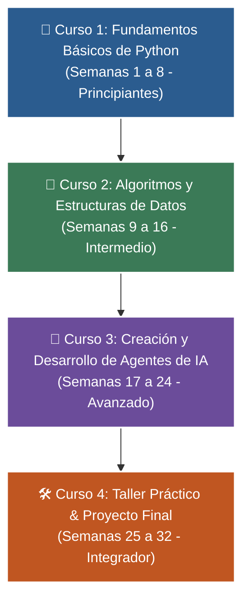

# 🐍 Programa Integral de Formación en Python
### *De Cero a Agentes de Inteligencia Artificial (32 Semanas)*

-   :material-school: __Nivel:__ Principiante a Avanzado (4 Cursos &bull; 32 Clases)
-   :material-account-tie: __Instructor:__ [William Rodríguez (Wisrovi)](https://wisrovi.dev)
-   :material-code-tags: __Tecnologías:__ Python 3.10+, FastAPI, Streamlit, Pydantic, RAG, ReAct Agents
-   :material-license: __Licencia:__ Código Abierto (MIT)

Bienvenido/a a la plataforma web interactiva del **Programa de Formación en Python**. Esta academia online está estructurada en **4 cursos de 8 semanas cada uno (32 clases en total)** con contenido exhaustivo, código interactivo, cuadernos de Google Colab y pruebas automatizadas.

---

## 🚀 Hoja de Ruta del Programa (32 Semanas)

---

## 📚 Explorador de los 4 Cursos

=== "🎯 Curso 1: Fundamentos (8 Semanas)"
    *   **Público:** Principiantes Absolutos.
    *   **Temas:** Variables, Condicionales, Bucles, Listas, Diccionarios, Funciones y Proyecto CLI.
    *   [👉 Ver Curso 1 Completo](curso-01/book.md)

=== "🚀 Curso 2: Algoritmos y Estructuras (8 Semanas)"
    *   **Público:** Nivel Intermedio y preparación para entrevistas de ingeniería.
    *   **Temas:** Big-O, Pilas/Colas con `deque`, Sets O(1), Búsqueda Binaria, QuickSort, Árboles BST, Grafos BFS/DFS y Memoización.
    *   [👉 Ver Curso 2 Completo](curso-02/book.md)

=== "🤖 Curso 3: Agentes de Inteligencia Artificial (8 Semanas)"
    *   **Público:** Nivel Avanzado en IA aplicada.
    *   **Temas:** LLMs, Prompt Engineering, Pydantic V2, Tool Calling, Embeddings, RAG, Ciclo ReAct y Multi-Agentes.
    *   [👉 Ver Curso 3 Completo](curso-03/book.md)

=== "🛠️ Curso 4: Proyecto Final Integrador (8 Semanas)"
    *   **Público:** Nivel Profesional y Portafolio.
    *   **Temas:** Arquitectura Limpia, Backend FastAPI, Base de Datos SQL ACID, Frontend Streamlit, Integración de IA, Pytest, Docker Compose y CI/CD.
    *   [👉 Ver Curso 4 Completo](curso-04/book.md)
