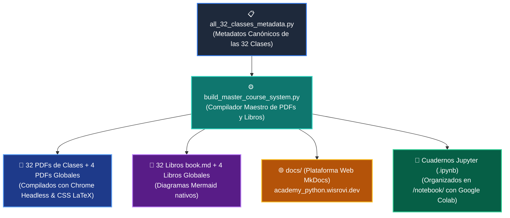

# 🛠️ Herramientas de Compilación y Mantenimiento del Repositorio

> **Ubicación:** `scripts/`  
> **Uso:** Exclusivo para administradores y compilación automatizada (CI/CD).  
> **Audiencia:** Los estudiantes no necesitan ejecutar estos scripts para su formación.

---

## 🗺️ Arquitectura del Sistema de Compilación

---

## 📑 Catálogo de Scripts de Utilidad

| Script | Descripción del Proceso |
| :--- | :--- |
| **`all_32_classes_metadata.py`** | Diccionario central con la teoría, código, modelos mentales y retos de las 32 clases. |
| **`build_master_course_system.py`** | Compilador integral de PDFs, `book.md`, `.ipynb`, `docs/` y `mkdocs.yml`. |
| **`generate_all_class_examples.py`** | Generador de las 128+ subcarpetas de ejemplos estructurados con `main.py` y `README.md`. |
| **`centralize_tests_in_root.py`** | Centraliza todas las suites de Pytest en la carpeta `/tests/`. |
| **`refine_all_mermaid_styles.py`** | Aplica el estándar de estilo visual moderno a todos los diagramas Mermaid del repositorio. |
| **`ensure_all_readmes.py`** | Auditoría y verificación de que cada directorio cuente con su archivo `README.md`. |
