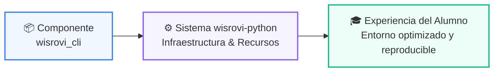

# 📁 Src ➔ Wisrovi_Cli

> **Ubicación en Repositorio:** `src/wisrovi_cli`  

---

## 🌀 Propósito en la Arquitectura del Proyecto

---

## 📑 Descripción y Recursos
Este directorio forma parte de la infraestructura integral del programa de formación en Python.
