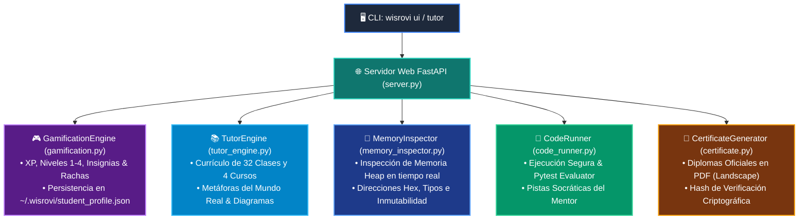

# 🏛️ Wisrovi Academy Core Library (`wisrovi_lib`)

El paquete **`wisrovi_lib`** es el motor central que impulsa el **Tutor Virtual Interactivo**, el sistema de **Gamificación RPG**, el **Inspector de Memoria Heap/Stack** y el **Generador Oficial de Certificados en PDF**.

---

## 🗺️ Arquitectura de la Librería



---

## 📦 Módulos Principales

| Módulo | Archivo | Responsabilidad |
| :--- | :--- | :--- |
| **Gamificación** | [`gamification.py`](file:///home/wisrovi/Documents/wisrovi-python/src/wisrovi_lib/gamification.py) | Administra los perfiles de usuario, XP, desbloqueo de insignias y niveles. |
| **Currículo & Pedagogía** | [`tutor_engine.py`](file:///home/wisrovi/Documents/wisrovi-python/src/wisrovi_lib/tutor_engine.py) | Proveedor estructurado de conceptos, código, metáforas y retos de las 32 clases. |
| **Inspector de Memoria** | [`memory_inspector.py`](file:///home/wisrovi/Documents/wisrovi-python/src/wisrovi_lib/memory_inspector.py) | Mapea variables, direcciones hexadecimales (`id`), tamaños en RAM y mutabilidad. |
| **Ejecutor & Evaluador** | [`code_runner.py`](file:///home/wisrovi/Documents/wisrovi-python/src/wisrovi_lib/code_runner.py) | Evalúa retos en vivo contra la suite de Pytest y genera sugerencias socráticas. |
| **Certificación PDF** | [`certificate.py`](file:///home/wisrovi/Documents/wisrovi-python/src/wisrovi_lib/certificate.py) | Compila diplomas oficiales apaisados de alta resolución vía Chrome Headless. |
| **Servidor & Frontend** | [`server.py`](file:///home/wisrovi/Documents/wisrovi-python/src/wisrovi_lib/server.py) & [`static/`](file:///home/wisrovi/Documents/wisrovi-python/src/wisrovi_lib/static/) | API REST y aplicación web Single-Page Application (SPA) para el estudiante. |

---

## 🚀 Uso Programático (`import wisrovi_lib`)

```python
from wisrovi_lib import MemoryInspector, CertificateGenerator, GamificationEngine

# 1. Inspeccionar objetos en memoria RAM
res = MemoryInspector.execute_and_inspect("x = 42; y = 'Wisrovi'")
print(res["memory_variables"])

# 2. Generar un certificado de graduación
CertificateGenerator.generate_pdf(
    student_name="Alejandro Martínez",
    output_pdf_path="mi_certificado.pdf",
    hours=160
)
```
