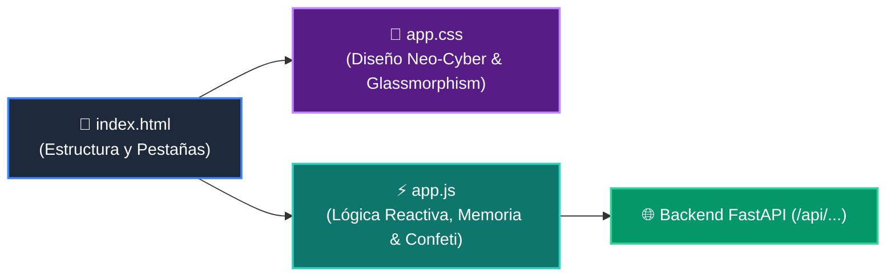

# 🎨 Interfaz Web Estática del Tutor Virtual (`wisrovi_lib/static`)

Esta carpeta contiene los archivos de la aplicación web Single-Page Application (SPA) para la experiencia gamificada del estudiante.

---

## 🗺️ Componentes de la Interfaz

* **`index.html`**: Estructura semántica con barra de XP, visor Mermaid, editor de código, arenero y modal de certificación.
* **`app.css`**: Sistema de diseño con paleta de alto contraste, temas oscuros y adaptabilidad responsive.
* **`app.js`**: Controlador de eventos, renderizado en vivo de gráficos de memoria, ejecuciones asíncronas y animaciones de victoria.
