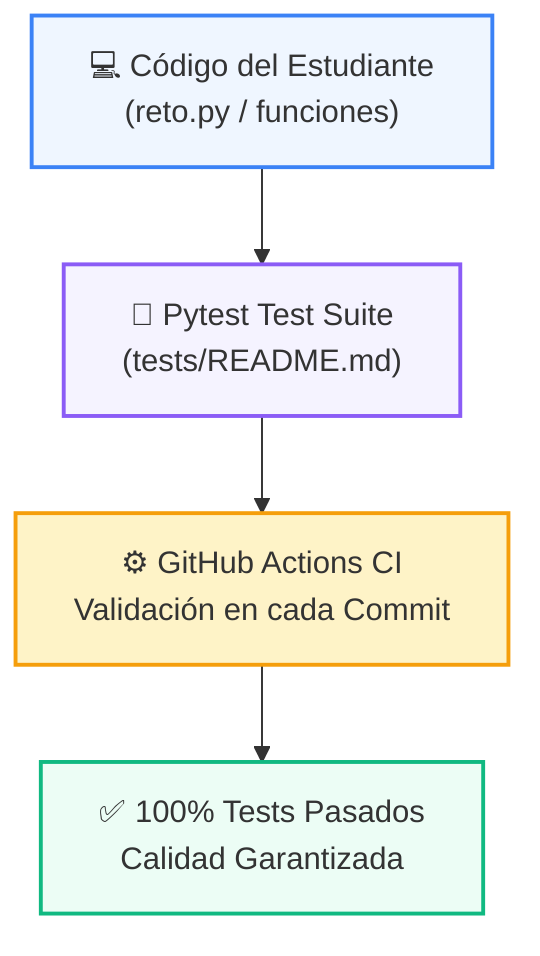

# 🧪 Suite de Pruebas Automatizadas (Pytest)

> **Módulo:** `README.md`  
> **Ubicación:** `tests`  

---

## 🌀 Pirámide y Flujo de Verificación de Calidad



---

## 💻 Comandos de Ejecución

```bash
# Ejecutar todas las pruebas de este módulo
pytest tests/

# Ejecutar con reporte detallado
pytest -v tests/
```
