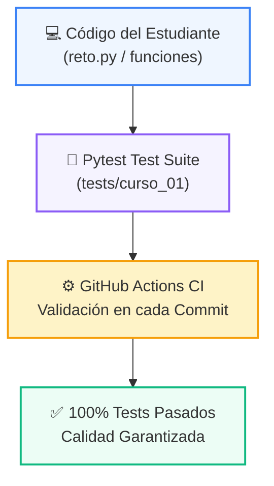

# 🧪 Suite de Pruebas Automatizadas (Pytest)

> **Módulo:** `curso_01`  
> **Ubicación:** `tests/curso_01`  

---

## 🌀 Pirámide y Flujo de Verificación de Calidad



---

## 💻 Comandos de Ejecución

```bash
# Ejecutar todas las pruebas de este módulo
pytest tests/curso_01/

# Ejecutar con reporte detallado
pytest -v tests/curso_01/
```
