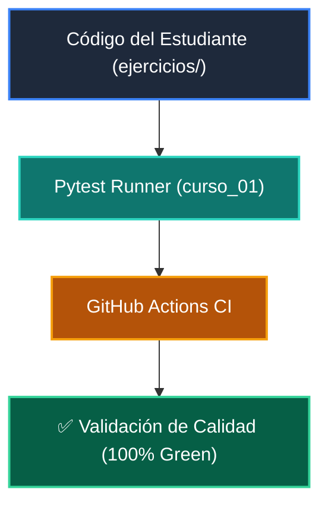

# 🧪 Suite de Pruebas: Curso_01

> **Ubicación:** `tests/curso_01`  

---

## 🗺️ Estructura de Verificación Automatizada


```mermaid
flowchart TD
    CODE["Código del Estudiante (ejercicios/)"] --> PYTEST["Pytest Runner (curso_01)"]
    PYTEST --> CI["GitHub Actions CI"]
    CI --> PASS["✅ Validación de Calidad (100% Green)"]

    style CODE fill:#1e293b,color:#fff,stroke:#3b82f6,stroke-width:2px
    style PYTEST fill:#0f766e,color:#fff,stroke:#2dd4bf,stroke-width:2px
    style CI fill:#b45309,color:#fff,stroke:#f59e0b,stroke-width:2px
    style PASS fill:#065f46,color:#fff,stroke:#34d399,stroke-width:2px
```

---

## 💻 Comandos de Ejecución
```bash
pytest tests/curso_01/
```
